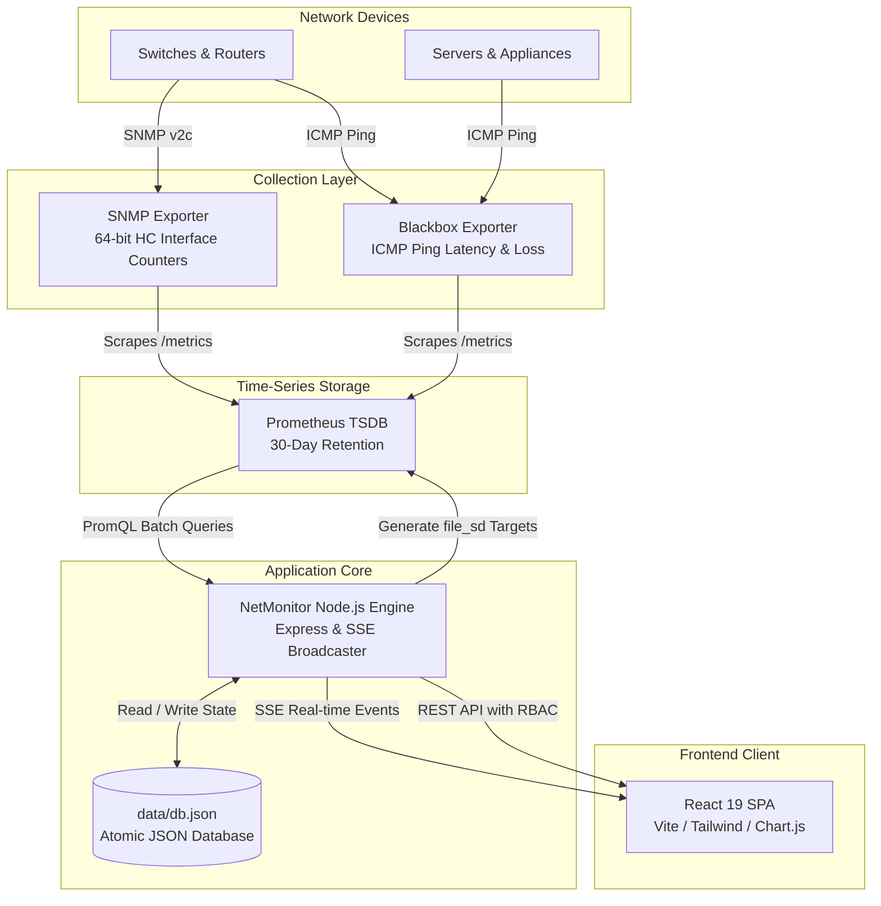

# NetMonitor: Developer & Architecture Guide

This guide details the internal system architecture, data pipelines, codebase organization, development workflows, testing requirements, and coding conventions for **NetMonitor Enterprise**.

---

## 1. System Architecture & Telemetry Pipeline

NetMonitor is engineered as a low-overhead, single-instance observability engine.



### Component Roles & Communication
1. **Dynamic Target Discovery (`file_sd_configs`)**:
   - The backend dynamically writes `/etc/prometheus/targets/snmp_targets.yml` and `/etc/prometheus/targets/blackbox_targets.yml`.
   - Prometheus checks these files every 15 seconds, discovering enrolled devices without process restarts.
2. **Server-Sent Events (SSE) Push Engine**:
   - Streams live alerts (`/api/alerts/active`), traffic stats (`/api/storage/stream/traffic`), and system metrics (`/api/system/stream`).
   - Supports both `Authorization: Bearer <token>` and `?token=<token>` query parameters for native browser `EventSource` connections.
3. **Atomic Persistence Layer**:
   - Stores device inventory, topology positions, and system settings in `data/db.json`.
   - Pre-write snapshotting (`db.json.bak`) and atomic temporary swaps guarantee zero database corruption upon power loss or process termination.

---

## 2. Codebase Organization

```
network-monitor-react/
├── config/                  # Canonical configuration files (Single source of truth)
│   ├── nginx/               # Reverse proxy rules & security headers
│   ├── prometheus/          # Prometheus TSDB scrape configuration
│   └── snmp_exporter/       # Multi-vendor SNMP exporter profiles
├── deploy/                  # Production deployment manifests
│   ├── docker-compose.yml   # Multi-container orchestration stack
│   └── systemd/             # Linux systemd service definitions
├── docs/                    # Architectural audits & technical reports
├── scripts/                 # Standalone maintenance & validation utilities
│   ├── initialize-security.js
│   ├── package-release.js
│   ├── security-scan.js
│   ├── validate-prometheus-targets.js
│   ├── validate-snmp-config.js
│   └── verify-clean-install.js
├── server/                  # Core Node.js backend
│   ├── middleware/          # Rate limiting & RBAC middlewares
│   ├── services/            # Backup & cryptographic restoration services
│   ├── scanner.js           # Subnet IP & SNMP discovery crawler
│   ├── setupPrometheusSnmp.js # Prometheus file_sd generator
│   └── server.js            # Express application entry point & SSE broadcaster
├── src/                     # React 19 frontend
│   ├── components/          # UI modules (dashboard, traffic, topology, alerts)
│   ├── utils/               # Formatting & API helpers (trafficFormat.js)
│   ├── App.jsx              # Main application shell
│   └── main.jsx             # React DOM entry point
└── tests/                   # Automated unit & integration test suites
```

---

## 3. Local Development Workflow

### Prerequisites
- Node.js 18.x or 20.x LTS
- npm 9.x or 10.x

### Setup & Launch
```bash
# 1. Install root & server dependencies
npm install
cd server && npm install && cd ..

# 2. Start Backend Engine (Terminal 1)
node server/server.js

# 3. Start Frontend Vite Dev Server (Terminal 2)
npm run dev
```
The Vite development server runs on `http://localhost:5173` and automatically proxies `/api` calls to the backend on port `5001`.

---

## 4. Testing & Verification Pipeline

NetMonitor contains 13 automated test suites verifying every subsystem:

```bash
# Run all automated test suites
npm test

# Run code style & lint inspection
npm run lint

# Compile production frontend bundle
npm run build
```

### Key Test Suites:
- `tests/test_phase3_phase4_security.cjs`: PBKDF2 hashing, timing-safe checks, and RBAC boundaries.
- `tests/test_phase5_query_security.cjs`: PromQL proxy rate limiter and time-range security.
- `tests/test_phase6_traffic.cjs`: Traffic semantics (zero vs no-data) and unit formatting.
- `tests/test_phase7_deployment_targets.cjs`: Target directory permissions and target syntax verification.
- `tests/test_phase8_snmp_concurrency.cjs`: Batch concurrency and partial failure isolation.
- `tests/test_phase11_backup_restore.cjs`: Database export, SHA-256 checksum verification, and atomic restoration.
- `scripts/verify-clean-install.js`: End-to-end sandbox clean installation verification.
- `scripts/security-scan.js`: Static scanner ensuring 0 leaked credentials or hardcoded secrets.

---

## 5. Coding Standards & Core Invariants

1. **Traffic Semantics (Section 20 & 21)**:
   - Always format traffic rates using `src/utils/trafficFormat.js`.
   - Active interfaces with 0 bps report `status: 'ok'` and format as `0.00 Mbps` (`isNoData: false`).
   - Unreachable interfaces report `status: 'no_data'` and format as `No Data` (`isNoData: true`).
   - Display labels must strictly use `Mbps` for network bitrates (never confuse with `MB/s`).
2. **Concurrency & Partial Failure Isolation (Section 39)**:
   - Background polling and discovery sweeps must use worker queues governed by `SNMP_CONCURRENCY_LIMIT` (default: 5).
   - Timeouts on individual devices must never abort or delay the remaining devices in a batch.
3. **Zero Secrets Invariant (Section 45)**:
   - Never commit passwords, tokens, private keys, or actual SNMP community strings.
   - All tests must verify against placeholders or environment variables. Run `node scripts/security-scan.js` before submitting changes.
