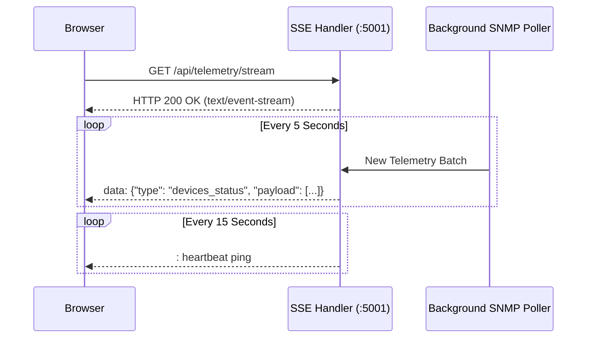

# NetMonitor: Core Engineering & Developer Guide

This document is the authoritative engineering guide for developers, architects, and contributors building, extending, or maintaining the **NetMonitor** platform.

---

## Table of Contents

1. [Architectural Philosophy](#1-architectural-philosophy)
2. [Codebase & Directory Layout](#2-codebase--directory-layout)
3. [REST API Reference & Data Schemas](#3-rest-api-reference--data-schemas)
   - [Authentication Endpoints (`/api/auth`)](#authentication-endpoints-apiauth)
   - [Setup & Onboarding (`/api/setup`)](#setup--onboarding-apisetup)
   - [Document Storage & Inventory (`/api/storage`)](#document-storage--inventory-apistorage)
   - [Historical Analytics (`/api/analytics`)](#historical-analytics-apianalytics)
   - [Real-Time Telemetry Stream (`/api/telemetry/stream`)](#real-time-telemetry-stream-apitelemetrystream)
   - [Alert Management (`/api/alerts`)](#alert-management-apialerts)
4. [Vectorized Batch PromQL Architecture](#4-vectorized-batch-promql-architecture)
5. [Topology Discovery Engine & Spatial Hashing](#5-topology-discovery-engine--spatial-hashing)
   - [Reciprocal Link Deduplication](#reciprocal-link-deduplication)
   - [O(1) Spatial Hash Grid Canvas Engine](#o1-spatial-hash-grid-canvas-engine)
   - [Auto-Layout Algorithms](#auto-layout-algorithms)
6. [Telemetry Streaming & Server-Sent Events (SSE)](#6-telemetry-streaming--server-sent-events-sse)
7. [Testing Framework & Test Suites](#7-testing-framework--test-suites)
8. [Contribution Guidelines & Best Practices](#8-contribution-guidelines--best-practices)

---

## 1. Architectural Philosophy

NetMonitor was built to address real-world performance degradations in network monitoring:

### 1. Zero Heavy Framework Overhead
The backend is written in **vanilla Node.js** using standard library modules (`http`, `crypto`, `fs`, `path`). This guarantees:
* Sub-10ms server cold boot time.
* Total memory footprint under 60 MB RAM for the backend process.
* Zero susceptibility to common third-party package vulnerabilities.

### 2. Elimination of the N+1 Scrape & Query Anti-Pattern
In traditional monitoring, viewing 50 switches triggers 50 separate Prometheus queries or HTTP calls. NetMonitor executes **Vectorized Batch PromQL queries** across all instances simultaneously using regular expression instance selectors (`instance=~"10\\.0\\.0\\.1|10\\.0\\.0\\.2..."`), condensing network roundtrips into a single query.

### 3. Crash-Proof Atomic Document Storage
Database operations in NetMonitor write to a temporary file (`db.json.tmp`) before performing a filesystem rename (`fs.renameSync`). This POSIX atomic operation ensures that even sudden power loss or process kill signals never result in a corrupted database.

---

## 2. Codebase & Directory Layout

```
NetMonitor/
├── config/                     # Service configuration templates
│   ├── examples/               # Example Prometheus targets & device templates
│   ├── nginx/                  # Nginx reverse proxy configuration
│   └── prometheus/             # Prometheus scrape configs & alert rules
├── data/                       # Document persistence directory
│   ├── db.json                 # Atomic JSON database (devices, settings, topology)
│   ├── devices.template.json   # Clean generic starter templates
│   └── targets/                # Dynamic Prometheus file_sd_configs
│       ├── blackbox/           # Dynamic ICMP ping targets
│       └── snmp/               # Dynamic SNMP telemetry targets
├── server/                     # Backend API & Orchestration Service
│   ├── server.js               # Core HTTP server, REST routes, SSE, & alerting
│   ├── snmpMapper.js           # Multi-vendor SNMP OID to metric translation
│   ├── setupPrometheusSnmp.js  # Automated target & auth profile generator
│   └── package.json            # Backend dependencies
├── src/                        # Frontend Single Page Application (React 18 + Vite)
│   ├── components/             # Reusable UI component modules
│   │   ├── auth/               # Login, Break-glass, & session components
│   │   ├── common/             # Navbar, Badges, Modals, Buttons
│   │   ├── dashboard/          # Real-time metrics grid & summary cards
│   │   ├── devices/            # Device Manager & CRUD forms
│   │   ├── grafana/            # Embedded Grafana panel proxy
│   │   ├── settings/           # Global settings, SNMP, & Webhook forms
│   │   ├── setup/              # First-Run Onboarding Wizard
│   │   └── topology/           # 60 FPS HTML5 Canvas 2D topology engine
│   ├── context/                # React Contexts (Auth, Device, Topology)
│   ├── services/               # Client-side API clients & PromQL utilities
│   │   ├── api.js              # HTTP client with JWT interceptor
│   │   ├── prometheusService.js# Vectorized PromQL queries & batch builders
│   │   └── storageService.js   # Local/Remote sync orchestrator
│   ├── App.jsx                 # Root router & layout wrapper
│   └── main.jsx                # React DOM entry point
├── tests/                      # Automated Verification & Integration Suites
│   ├── test_config_redesign.cjs# Tests Prometheus target generator logic
│   ├── test_final_integration.cjs # 20 Master end-to-end integration scenarios
│   ├── test_settings_runtime.cjs # Tests RBAC, sanitization, and runtime configs
│   ├── test_target_generator.cjs # Tests target file CRUD & disk sync
│   ├── test_analytics_platform.cjs # Tests range queries, cache TTL, and CSV
│   └── test_wan_promql.cjs     # Tests WAN PromQL hierarchy & fallback builder
├── Dockerfile                  # Multi-stage container build
├── docker-compose.yml          # 4-tier orchestration definition
└── package.json                # Frontend build scripts & tools
```

---

## 3. REST API Reference & Data Schemas

All REST endpoints reside under the `/api` prefix and return JSON payloads.

### Authentication Endpoints (`/api/auth`)

#### `POST /api/auth/login`
Authenticates user and sets an HTTP-only session cookie.
* **Request:**
  ```json
  {
    "username": "admin",
    "password": "your_secure_password"
  }
  ```
* **Response (200 OK):**
  ```json
  {
    "success": true,
    "user": {
      "username": "admin",
      "role": "admin",
      "isEmergency": false
    }
  }
  ```

#### `GET /api/auth/me`
Validates the current session token from cookie or Authorization header.
* **Response (200 OK):**
  ```json
  {
    "authenticated": true,
    "user": { "username": "admin", "role": "admin" }
  }
  ```

#### `POST /api/auth/emergency-password`
*Privilege Required: `admin`*
Rotates the emergency break-glass administrative password.
* **Request:**
  ```json
  { "newPassword": "SecureEmergencyPass123!" }
  ```

---

### Setup & Onboarding (`/api/setup`)

#### `GET /api/setup/status`
Returns whether the initial onboarding wizard has been executed.
* **Response (200 OK):**
  ```json
  { "isConfigured": false }
  ```

#### `POST /api/setup/complete`
Submits initial organization parameters, creates the admin credential, sets `isConfigured: true`, and issues an authenticated session.
* **Request:**
  ```json
  {
    "orgName": "Enterprise Corp",
    "prometheusUrl": "http://localhost:9090",
    "grafanaUrl": "http://localhost:3000",
    "defaultDiscoveryCidr": "10.0.0.0/24",
    "defaultCommunity": "public",
    "adminPassword": "StrongPassword123!"
  }
  ```

---

### Document Storage & Inventory (`/api/storage`)

#### `GET /api/storage/devices`
Fetches all managed devices. Sensitive community strings are masked.
* **Response (200 OK):**
  ```json
  [
    {
      "id": "dev-001",
      "name": "SW-CORE-01",
      "ip": "10.0.0.1",
      "role": "L3 Switch",
      "type": "L3 Switch",
      "community": "***",
      "hasCommunity": true,
      "auth": "public_v2",
      "module": "cisco"
    }
  ]
  ```

#### `POST /api/storage/devices`
*Privilege Required: `editor` or `admin`*
Persists device inventory updates and triggers immediate Prometheus target regeneration.

#### `GET /api/storage/settings`
Returns system settings with sensitive tokens masked.

#### `POST /api/storage/settings`
*Privilege Required: `admin`*
Updates global monitoring configuration. Preserves existing tokens if payload contains `***`.

---

### Historical Analytics (`/api/analytics`)

#### `GET /api/analytics/query_range`
Queries Prometheus time-series range metrics with dynamic step resolution and server-side 5-minute caching.
* **Query Parameters:**
  * `metric`: Metric key (`cpu`, `memory`, `bandwidth`, `interface_util`, `latency`, `packet_loss`, `availability`)
  * `range`: Time range (`1h`, `6h`, `24h`, `7d`, `30d`, `custom`)
  * `step`: Granularity in seconds (`30`, `60`, `120`, `900`, `7200`)
  * `start` / `end`: Unix timestamps for custom ranges
* **Response (200 OK):**
  ```json
  {
    "metric": "cpu",
    "range": "24h",
    "cached": false,
    "series": [
      {
        "instance": "10.0.0.1",
        "values": [
          [1700000000, "14.2"],
          [1700000120, "15.8"]
        ]
      }
    ]
  }
  ```

---

### Real-Time Telemetry Stream (`/api/telemetry/stream`)

Streams real-time device status and telemetry via **Server-Sent Events (SSE)**.
* **Connection:** `GET /api/telemetry/stream` with `Accept: text/event-stream`.
* **Event Types:**
  * `devices_status`: Array of reachability statuses (`online`, `offline`, `degraded`).
  * `alerts_active`: Current firing alert list.
  * `heartbeat`: Keep-alive ping sent every 15 seconds (`: ping\n\n`).

---

## 4. Vectorized Batch PromQL Architecture

NetMonitor avoids querying Prometheus in loops. For instance, rather than querying 60 switches individually for traffic, the `prometheusService.js` compiles a single vectorized regular expression:

```promql
# Vectorized Inbound Traffic Across All Managed Switches
rate(ifHCInOctets{instance=~"10\\.0\\.0\\.1|10\\.0\\.0\\.2|10\\.0\\.0\\.3"}[5m]) * 8
```

### WAN Interface Fallback Hierarchy
When querying WAN uplink interfaces, NetMonitor utilizes a robust fallback hierarchy implemented in `buildWanPromQL`:

```promql
# 1. Primary: 64-bit High-Capacity Counters for configured WAN interface
((max(sum by (instance) (rate(ifHCInOctets{instance="10.0.0.1", ifDescr=~".*Port-channel2.*"}[5m]))) * 8 / 1000000) > 0)
or
# 2. Secondary: 32-bit Legacy Counters for configured WAN interface
((max(sum by (instance) (rate(ifInOctets{instance="10.0.0.1", ifDescr=~".*Port-channel2.*"}[5m]))) * 8 / 1000000) > 0)
or
# 3. Automatic Uplink Fallback Regex
((max(sum by (instance) (rate(ifHCInOctets{ifDescr=~".*uplink|core|backbone.*"}[5m]))) * 8 / 1000000) > 0)
or
# 4. Safe Numerical Baseline
vector(0)
```

---

## 5. Topology Discovery Engine & Spatial Hashing

### Reciprocal Link Deduplication
During network crawls, two switches connected by an Ethernet cable both report each other:
* Switch A reports Switch B as a neighbor on Port 1.
* Switch B reports Switch A as a neighbor on Port 48.

The deduplication engine in `TopologyContext.jsx` creates a canonical key for every candidate link:
```javascript
function getCanonicalLinkKey(srcId, dstId) {
  return [srcId, dstId].sort().join('<-->');
}
```
If Switch A detected Switch B via Cisco CDP, and Switch B detected Switch A via IEEE LLDP, the link is merged into a single bidirectional edge labeled `CDP+LLDP` with confidence `1.0` (100%).

### O(1) Spatial Hash Grid Canvas Engine
Rendering 300 nodes and 500 links on standard DOM or SVG elements degrades frame rates below 15 FPS. NetMonitor implements a custom **HTML5 2D Canvas engine** using spatial bucket partitioning:

```javascript
class SpatialHashGrid {
  constructor(cellSize = 100) {
    this.cellSize = cellSize;
    this.grid = new Map();
  }

  insert(node) {
    const key = `${Math.floor(node.x / this.cellSize)}:${Math.floor(node.y / this.cellSize)}`;
    if (!this.grid.has(key)) this.grid.set(key, []);
    this.grid.get(key).push(node);
  }

  queryPoint(x, y) {
    const key = `${Math.floor(x / this.cellSize)}:${Math.floor(y / this.cellSize)}`;
    return this.grid.get(key) || [];
  }
}
```
* **Performance:** Node hit-testing (mouse hover, drag-and-drop, marquee selection) executes in `O(1)` constant time instead of `O(N)` linear searches, maintaining 60 FPS under all zoom levels.

### Auto-Layout Algorithms
1. **Hierarchical Tier Layout:**
   Categorizes nodes into vertical tiers (`Core` ➔ `Distribution` ➔ `Access` ➔ `Edge`) and applies barycenter heuristics to minimize edge crossings.
2. **Force-Directed Physics Layout:**
   Simulates nodes as electrically charged particles (Coulomb repulsion) and links as physical springs (Hooke's law), iteratively cooling node displacement via simulated annealing.

---

## 6. Telemetry Streaming & Server-Sent Events (SSE)

The NetMonitor backend maintains an active SSE client pool.



To prevent memory leaks, disconnected clients are immediately purged from the active connection set using the `req.on('close')` event.

---

## 7. Testing Framework & Test Suites

NetMonitor includes a comprehensive regression test suite with zero external testing dependencies. All tests are executable via standard Node.js.

### Running Test Suites
```bash
# Run all automated tests
npm test
```

### Test Suite Inventory

| Test Script | Target System | Validations |
| :--- | :--- | :--- |
| `test_final_integration.cjs` | Master Integration | 20 end-to-end scenarios covering auth, CRUD, alert dispatch, failover, target file regeneration, and memory stability |
| `test_analytics_platform.cjs` | Historical Analytics | Dynamic step resolution, statistical aggregations (Avg/Max/Min), CSV formatting, 5-minute cache TTL |
| `test_settings_runtime.cjs` | RBAC & Security | Settings validation, secret masking (`***`), privilege enforcement |
| `test_target_generator.cjs` | Target Synchronization | File write atomicity, Prometheus reload hooks, empty state (`[]`) safety |
| `test_wan_promql.cjs` | WAN PromQL Engine | Fallback hierarchy, HC counter precedence, regex sanitization |
| `test_config_redesign.cjs` | SNMP Profiles | Auth profile mapping (`public_v2`, `enterprise_v3`) |

---

## 8. Contribution Guidelines & Best Practices

1. **Maintain Zero Runtime Dependencies:** Do not add heavy dependencies (e.g., Express, Lodash, Axios) to `server/package.json` unless approved via an architectural review.
2. **Preserve Atomic File Writes:** Any logic mutating `data/db.json` or target files must route through `updateDb()` or atomic write functions.
3. **No Unsanitized Secret Leaks:** Never return plaintext passwords or SNMP community strings in API responses.
4. **All Tests Must Pass:** Ensure `npm test` passes with 0 failures before opening any Pull Request:
   ```bash
   npm test && npm run build
   ```

---

*Engineered with precision for resilient, observable, and high-performance enterprise networks.*
