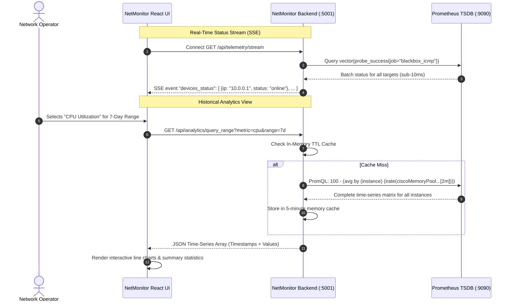
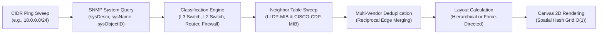

# NetMonitor: Enterprise Network Observability & Management Platform

[English](README.md) | [ภาษาไทย](README.th.md)

[](https://nodejs.org/)
[](https://react.dev/)
[](https://vitejs.dev/)
[](https://prometheus.io/)
[](https://tailwindcss.com/)
[](https://opensource.org/licenses/MIT)

**NetMonitor** is an enterprise-grade, turn-key Network Observability and Management Platform engineered for modern campus, data center, and branch office networks. It unifies **real-time device health monitoring**, **historical time-series telemetry analytics**, and **semi-automatic L2/L3 topology discovery** into an intuitive, lightweight web dashboard.

Designed specifically to eliminate the overhead of complex, monolithic network management suites, NetMonitor leverages high-efficiency **Prometheus batch PromQL queries**, **Server-Sent Events (SSE)** for zero-polling real-time updates, and an **in-memory spatial topology engine** capable of rendering hundreds of nodes at 60 FPS.

---

## Table of Contents

1. [Project Overview & Value Proposition](#1-project-overview--value-proposition)
2. [Key Features](#2-key-features)
3. [Architecture & Data Flow](#3-architecture--data-flow)
4. [Technology Stack](#4-technology-stack)
5. [Prerequisites & System Requirements](#5-prerequisites--system-requirements)
6. [Quick Start Guide](#6-quick-start-guide)
7. [Installation Options](#7-installation-options)
   - [Option A: Bare-Metal / Linux VM (Ubuntu/Debian)](#option-a-bare-metal--linux-vm-ubuntudebian)
   - [Option B: Docker & Docker Compose](#option-b-docker--docker-compose)
   - [Option C: Proxmox VE LXC Container](#option-c-proxmox-ve-lxc-container)
8. [Configuration Guide](#8-configuration-guide)
9. [Auto-Discovery & Topology](#9-auto-discovery--topology)
10. [Metrics & Telemetry](#10-metrics--telemetry)
11. [Alerts & Webhooks](#11-alerts--webhooks)
12. [Security & RBAC](#12-security--rbac)
13. [Troubleshooting & FAQ](#13-troubleshooting--faq)
14. [License & Contributing](#14-license--contributing)

---

## 1. Project Overview & Value Proposition

Traditional network monitoring setups often suffer from critical architectural bottlenecks:
* **The N+1 Query Problem:** Dashboards executing individual API or PromQL queries per device, resulting in database lockup or browser freeze when monitoring 50+ switches.
* **Scrape Timeouts & Duplication:** Running duplicate ping and SNMP collection pipelines that overwhelm device management CPUs.
* **Stale or Static Topology Maps:** Manually drawn network diagrams that become outdated immediately after physical patch changes or link failovers.
* **High Maintenance Overhead:** Fragile database servers that corrupt after sudden power outages.

**NetMonitor solves these challenges through foundational architectural principles:**
* **Batch Telemetry Aggregation:** Fetches telemetry for all managed devices using vectorized PromQL queries, collapsing 100+ requests into a single sub-second query.
* **Atomic JSON Document Storage:** Zero-dependency, crash-resistant document storage with atomic filesystem writes (`.tmp` write followed by atomic rename), eliminating SQL database maintenance.
* **Dynamic Target File Generation:** NetMonitor directly generates Prometheus `file_sd_configs` YAML files (`snmp_targets.yml` and `blackbox_targets.yml`), synchronizing device inventories instantly with Prometheus without server restarts.
* **Carrier-Grade Discovery:** Combines SNMP IF-MIB, Bridge-MIB, Cisco CDP, and IEEE 802.1AB LLDP into a unified graph engine with automatic link deduplication and confidence scoring.

---

## 2. Key Features

### 📡 Real-Time Observability
* **Sub-Second ICMP & SNMP Probing:** Powered by Prometheus Blackbox Exporter and SNMP Exporter.
* **Zero-Polling Web Dashboard:** Server-Sent Events (SSE) push live device status, telemetry updates, and alerts directly to connected browsers.
* **Multi-Window Synchronization:** Multiple operators can view the dashboard simultaneously without multiplying load on the monitoring core.

### 📈 Historical Analytics Platform
* **7 Specialized Analytics Modules:**
  1. **Bandwidth & Traffic Throughput:** Inbound/Outbound octets with 64-bit HC counter support.
  2. **CPU Utilization:** Historical trend tracking across multi-core control and data planes.
  3. **Memory Consumption:** Memory pool allocation, buffer leak detection, and peak usage.
  4. **Latency & Packet Loss:** RTT jitter analysis and packet drops.
  5. **Interface Errors & Discards:** CRC error detection, frame drops, and physical link diagnostics.
  6. **Optical Power & Transceivers:** SFP/SFP+ optical RX/TX levels and temperature telemetry.
  7. **Port Saturation:** Link capacity threshold alarms (80%, 90%, 95%).
* **Dynamic Step Resolution Scaling:**
  * `1 Hour` ➔ 30-second granularity
  * `6 Hours` ➔ 1-minute granularity
  * `24 Hours` ➔ 2-minute granularity
  * `7 Days` ➔ 15-minute granularity
  * `30 Days` ➔ 2-hour granularity
* **Client-Side CSV Export:** One-click CSV export of historical telemetry with standard ISO 8601 timestamps for reporting.
* **Server-Side Range Query Cache:** 5-minute memory cache with automatic TTL pruning, delivering instant analytical comparisons.

### 🗺️ Semi-Automatic Topology Discovery
* **Dual Discovery Protocols:** Concurrent LLDP and CDP neighbor discovery.
* **Multi-Vendor Link Deduplication:** Automatically reconciles reciprocal links between heterogeneous vendors (e.g., Cisco switch reporting Aruba neighbor via CDP, while Aruba reports Cisco via LLDP).
* **Automated Link Classification:** Identifies Trunk, Uplink, Access, Discovered, and Manual links.
* **Dual Layout Modes:**
  * **Hierarchical Tier Layout:** Clean structured layering (Core ➔ Distribution ➔ Access ➔ Edge).
  * **Force-Directed Physics Layout:** Dynamic organic graph visualization with spring-embedder simulation.
* **O(1) Spatial Hash Grid Canvas:** Ultra-smooth HTML5 Canvas 2D rendering with pan, zoom, marquee selection, and spatial indexing for 300+ nodes.

### 🏭 Multi-Vendor Hardware Telemetry
* Native OID and MIB support for:
  * **Cisco Systems:** Catalyst, Nexus, CBS, SG-series (CISCO-PROCESS-MIB, CISCO-ENVMON-MIB, OLD-CISCO-SYS-MIB).
  * **Aruba Networks / HPE:** CX-series, ProCurve, OfficeConnect (STATISTICS-MIB, HP-ICF-CHASSIS).
  * **Ruckus / CommScope:** ICX-series (FOUNDRY-SN-SWITCH-GROUP-MIB).
  * **Huawei:** CloudEngine, S-series (HUAWEI-ENTITY-EXTENT-MIB).
  * **Generic RFC Standards:** MIB-II (RFC 1213), IF-MIB (RFC 2863), Entity-MIB (RFC 4133).
* Hardware sensors: CPU utilization, Memory free/used, Power Supply (PSU) redundancy, Fan trays, Chassis temperature, and PoE wattage budgets.

### 🔔 Smart Alerting & Deduplication
* **Flapping Prevention:** Configurable evaluation windows to prevent noisy alerts during transient brownouts.
* **Unified Notification Channels:** Native support for LINE Notify, LINE Messaging API, Telegram Bot, Slack, Discord, and Generic JSON Webhooks.
* **Alert Lifecycle Management:** Firing ➔ Acknowledged (by operator) ➔ Resolved ➔ Historical Archive.

### 🔐 Security & Access Control
* **Three-Tier RBAC:** `Admin` (full system control), `Editor` (device & topology management), `Viewer` (read-only observability).
* **Emergency Break-Glass Authentication:** Guaranteed local administrator login mechanism that functions even when external identity providers or networks are down.
* **Credential Isolation:** Passwords and SNMP community strings are never exposed to browser clients and are masked with `***` in API payloads.

---

## 3. Architecture & Data Flow

NetMonitor utilizes a decoupled, telemetry-driven architecture. The backend acts as an orchestrator and aggregator, keeping state in sync while delegating time-series indexing to Prometheus.

```mermaid
flowchart TD
    subgraph Network_Infrastructure ["Managed Network Infrastructure"]
        SW1["Core Switch (L3)"]
        SW2["Dist Switch (L3)"]
        SW3["Access Switch (L2)"]
        RT1["Edge Router"]
    end

    subgraph Collection_Layer ["Telemetry & Exporters Layer"]
        BBOX["Prometheus Blackbox Exporter (:9115)<br/>ICMP Ping Probing"]
        SNMP["Prometheus SNMP Exporter (:9116)<br/>IF-MIB, Entity-MIB, Vendor MIBs"]
    end

    subgraph TimeSeries_Storage ["Metric Storage Engine"]
        PROM["Prometheus TSDB (:9090)<br/>Scrape Intervals: 15s / 30s<br/>Retention: 30d - 90d"]
    end

    subgraph NetMonitor_Core ["NetMonitor Core System"]
        GEN["Target Generator<br/>Writes targets/*.yml"]
        SERVER["NetMonitor Backend (:5001)<br/>Node.js REST API + SSE Server"]
        DB[("Atomic Document Store<br/>data/db.json")]
        CACHE["Analytics Range Cache<br/>5-minute In-Memory TTL"]
    end

    subgraph Client_Applications ["Operator Interfaces"]
        UI["NetMonitor React SPA (:5001 / :80)<br/>Vite + Tailwind + Canvas 2D"]
        GRAFANA["Grafana Dashboards (:3000)<br/>Deep-dive Panels"]
    end

    SW1 & SW2 & SW3 & RT1 <-->|ICMP Echo| BBOX
    SW1 & SW2 & SW3 & RT1 <-->|SNMP v2c/v3| SNMP
    
    BBOX & SNMP -->|Scraped by HTTP| PROM
    
    SERVER -->|Generate Scrape Targets| GEN
    GEN -->|file_sd_configs| PROM
    
    SERVER <-->|Vectorized Batch PromQL| PROM
    SERVER <-->|Atomic Reads/Writes| DB
    SERVER <-->|Telemetry Query Cache| CACHE
    
    SERVER -->|Server-Sent Events (SSE)| UI
    SERVER <-->|REST API (JWT Auth)| UI
    PROM <-->|Embedded Panels| GRAFANA
```

### Batch PromQL Query Architecture

Rather than executing queries device-by-device, NetMonitor aggregates metrics across all devices using regex matchers:



---

## 4. Technology Stack

| Layer | Component | Version | Description |
| :--- | :--- | :--- | :--- |
| **Frontend** | React | 18.2.x | High-performance component-driven user interface |
| | Vite | 5.x | Instant hot-reloading bundler & asset optimizer |
| | Tailwind CSS | 3.x | Utility-first responsive design system with Dark Mode |
| | Lucide React | Latest | Clean, vector-optimized network and hardware iconography |
| | HTML5 Canvas | Native | High-speed 60 FPS graph rendering with spatial indexing |
| **Backend** | Node.js | 18.x / 20.x | Lightweight, zero-heavy-framework REST & SSE service |
| | Native Modules | `http`, `crypto`, `fs` | Maximum execution speed and minimal attack surface |
| **Telemetry** | Prometheus | 2.45+ LTS | Industrial-grade time-series metric storage |
| | SNMP Exporter | 0.24+ | Official Prometheus SNMP metric scraper |
| | Blackbox Exporter | 0.24+ | Multi-protocol network latency and reachability prober |
| | Grafana | 10.x | Optional companion visualization server |
| **Storage** | Atomic JSON Document | File-based | Crash-safe atomic document persistence |

---

## 5. Prerequisites & System Requirements

### Hardware Sizing Guidelines

| Deployment Size | Managed Devices | Minimum CPU | Minimum RAM | Disk Storage |
| :--- | :--- | :--- | :--- | :--- |
| **Small Branch** | 1 - 25 switches | 2 vCPU cores | 2 GB RAM | 20 GB SSD |
| **Medium Enterprise** | 25 - 150 switches | 4 vCPU cores | 4 GB RAM | 50 GB SSD |
| **Large Campus** | 150 - 500 switches | 8 vCPU cores | 8 GB RAM | 100 GB NVMe |

### Software Prerequisites
* **Operating System:** Linux (Ubuntu 22.04 LTS / 24.04 LTS, Debian 12, Rocky Linux 9, RHEL 9) or Windows Server 2022.
* **Node.js Environment:** Node.js `>= 18.0.0` and npm `>= 9.0.0`.
* **Network Access:**
  * ICMP Echo Request / Reply enabled on managed network subnets.
  * UDP Port `161` (SNMP) reachable from the NetMonitor host to all switches.
  * TCP Port `5001` (NetMonitor Web Application).
  * TCP Port `9090` (Prometheus API).
  * TCP Port `9116` (SNMP Exporter).
  * TCP Port `9115` (Blackbox Exporter).

---

## 6. Quick Start Guide

Get NetMonitor running locally in less than 5 minutes:

### 1. Clone the Repository
```bash
git clone https://github.com/Tannyzazanaja/NetMonitor.git
cd NetMonitor
```

### 2. Install Dependencies
```bash
# Install frontend and root dependencies
npm install

# Install backend dependencies
cd server
npm install
cd ..
```

### 3. Initialize Environment Configuration
```bash
cp .env.example .env
```
*(Optionally edit `.env` to define your specific Prometheus or Grafana ports).*

### 4. Build the Production Frontend
```bash
npm run build
```

### 5. Launch the NetMonitor Platform
```bash
# Start backend server with production assets served
node server/server.js
```

### 6. First-Run Onboarding Wizard
1. Open your browser and navigate to `http://localhost:5001`.
2. When starting with a fresh installation, the **First-Run Setup Wizard** will automatically launch.
3. Configure:
   * **Organization Name:** Enter your organization or company title.
   * **Telemetry Endpoints:** Verify Prometheus (`http://localhost:9090`) and Grafana URLs.
   * **Discovery Subnet:** Enter your network CIDR (e.g., `192.168.1.0/24` or `10.0.0.0/24`).
   * **Administrator Password:** Define your secure admin password.
4. Click **Complete Setup & Launch Dashboard**.

---

## 7. Installation Options

### Option A: Bare-Metal / Linux VM (Ubuntu/Debian)

For complete systemd service installation, Prometheus configuration, and automated daemon startup, refer to the exhaustive guide:
👉 **[Read Full INSTALLATION.md Guide](INSTALLATION.md)**

Summary commands:
```bash
# Setup user and directories
sudo useradd --no-create-home --shell /bin/false netmonitor
sudo mkdir -p /opt/netmonitor /etc/prometheus/targets
sudo chown -R netmonitor:netmonitor /opt/netmonitor /etc/prometheus/targets

# Setup systemd service
sudo cp deploy/netmonitor.service /etc/systemd/system/
sudo systemctl daemon-reload
sudo systemctl enable --now netmonitor
```

### Option B: Docker & Docker Compose

NetMonitor includes a production-ready `docker-compose.yml` orchestrating all four microservices:
1. `netmonitor` (Core Web & API)
2. `prometheus` (TSDB)
3. `snmp-exporter` (SNMP Scraper)
4. `grafana` (Analytics UI)

```bash
docker compose up -d
```
Check health:
```bash
docker compose ps
```

### Option C: Proxmox VE LXC Container

Deploying inside an unprivileged Proxmox LXC container delivers bare-metal performance with snapshot isolation:
1. Create Ubuntu 22.04 or 24.04 Standard LXC container (2 vCPU, 2048 MB RAM, 16 GB Disk).
2. Follow the standard Linux VM instructions detailed in [INSTALLATION.md](INSTALLATION.md#proxmox-lxc-deployment).

---

## 8. Configuration Guide

### Environment Variables (`.env`)

| Variable | Default Value | Description |
| :--- | :--- | :--- |
| `PORT` | `5001` | HTTP port for the web dashboard and backend API |
| `NODE_ENV` | `production` | Node environment (`production` or `development`) |
| `PROMETHEUS_URL` | `http://127.0.0.1:9090` | Internal URL to query Prometheus metrics |
| `PROMETHEUS_TARGETS_DIR` | `/etc/prometheus/targets` | Directory where `snmp_targets.yml` and `blackbox_targets.yml` are written |
| `SNMP_EXPORTER_URL` | `http://127.0.0.1:9116` | Internal URL to Prometheus SNMP Exporter |
| `BLACKBOX_EXPORTER_URL` | `http://127.0.0.1:9115` | Internal URL to Prometheus Blackbox Exporter |
| `GRAFANA_URL` | `http://127.0.0.1:3000` | URL for embedded Grafana telemetry dashboards |
| `SESSION_SECRET` | *(Random 64-char string)* | Key for signing HTTP-only session cookies |
| `JWT_SECRET` | *(Random 64-char string)* | Key for signing API JSON Web Tokens |
| `DEFAULT_SNMP_COMMUNITY` | `public` | Default fallback SNMP v2c community |
| `DEFAULT_SNMP_AUTH_PROFILE`| `public_v2` | Default auth module in `snmp.yml` |
| `LINE_CHANNEL_ACCESS_TOKEN`| *(Optional)* | Messaging API token for push notifications |
| `LINE_USER_ID` | *(Optional)* | Target Group ID or User ID for notifications |

### Configuring SNMP Exporter Auth Profiles (`snmp.yml`)

Ensure your `/etc/prometheus/snmp.yml` file contains matching authentication blocks for your devices:

```yaml
auths:
  public_v2:
    version: 2
    community: your_snmp_community_here
  enterprise_v3:
    version: 3
    username: netmon_user
    security_level: authPriv
    auth_protocol: SHA
    auth_password: YourAuthPassword
    priv_protocol: AES
    priv_password: YourPrivPassword
```

---

## 9. Auto-Discovery & Topology

NetMonitor features an intelligent network topology discovery engine that turns raw neighbor tables into an interactive, real-time map.



### Discovery & Deduplication Highlights
1. **Reciprocal Link Deduplication:** When Switch A (port Gi1/0/1) connects to Switch B (port Gi1/0/48), Switch A will report Switch B via CDP, and Switch B will report Switch A via LLDP. NetMonitor merges these two records into a single, high-confidence edge (`CDP+LLDP`, 100% confidence).
2. **Speed & Duplex Resolution:** Extracts negotiated interface speeds (`10G`, `1G`, `100M`) and assigns color-coded edge strokes with animated packet particles.
3. **Canvas Performance:** The custom Canvas 2D engine utilizes spatial bucket indexing (`O(1)` hover, drag, and click hit testing), enabling 60 FPS interaction even on graphs with 300+ devices and 500+ interconnects.

---

## 10. Metrics & Telemetry

NetMonitor collects, calculates, and stores telemetry across standard Prometheus metrics:

| Metric Category | Source Metric / PromQL | Description |
| :--- | :--- | :--- |
| **Device Reachability** | `probe_success{job="blackbox_icmp"}` | 1 = Reachable, 0 = Unreachable |
| **ICMP Latency** | `probe_duration_seconds{job="blackbox_icmp"} * 1000` | Round-trip latency in milliseconds |
| **Interface Traffic** | `rate(ifHCInOctets[5m]) * 8`, `rate(ifHCOutOctets[5m]) * 8` | Inbound / Outbound bits per second |
| **Interface Errors** | `rate(ifInErrors[5m]) + rate(ifOutErrors[5m])` | Physical error frame rate |
| **Cisco CPU** | `ciscoMemoryPoolUsed`, `cpmCPUTotal5minRev` | Core and process engine CPU utilization |
| **Aruba / HP CPU** | `hpSwitchCpuStat`, `arubaMemoryUsage` | Chassis control plane utilization |
| **Hardware Health** | `ciscoEnvMonSupplyState`, `ciscoEnvMonFanState` | Power supply and fan tray health status |

---

## 11. Alerts & Webhooks

NetMonitor includes an integrated alert management engine:

* **Instant Notification Dispatch:** Dispatches rich markdown-formatted cards with device name, IP address, severity level, failure duration, and direct management link.
* **Smart Alert Cooldown:** Enforces a configurable cooldown period (default: 5 minutes) to suppress duplicate notification floods during intermittent link flap events.
* **Operator Acknowledgement:** Allows operators to acknowledge firing alerts with a single click, silencing notifications while remediation is underway.
* **Webhook Integration:** Supports LINE Notify, Telegram Bot API, Slack incoming webhooks, and generic HTTP POST endpoints.

Example Generic Webhook Payload:
```json
{
  "event": "device_down",
  "device": {
    "name": "SW-CORE-01",
    "ip": "10.0.0.1",
    "location": "Main Data Center Rack A1",
    "type": "L3 Switch"
  },
  "severity": "CRITICAL",
  "message": "Device SW-CORE-01 (10.0.0.1) failed 3 consecutive ICMP probes",
  "timestamp": "2026-09-28T16:00:00Z"
}
```

---

## 12. Security & RBAC

NetMonitor enforces a zero-trust credential model:

1. **Role-Based Access Control (RBAC):**
   * **Viewer:** Read-only access to Dashboard, Topology, Device Lists, and Historical Analytics. Cannot alter system settings or devices.
   * **Editor:** Full operational access to add, edit, or remove devices, discover topology, and adjust view settings.
   * **Admin:** Unrestricted access including user management, SNMP credentials, webhook tokens, and Prometheus configurations.
2. **Emergency Break-Glass Authentication:**
   * In the event that external auth or primary credentials become inaccessible, NetMonitor provides a local emergency login mechanism accessible with the username `admin` or `emergency` and the pre-configured emergency secret.
3. **Secret Masking:**
   * All passwords, SNMP community strings, and notification tokens returned by `/api/storage/settings` and `/api/storage/devices` are irreversibly masked with `***`. Submitting masked secrets does not overwrite the backend's saved values.

---

## 13. Troubleshooting & FAQ

### Q1: Devices show "Offline" in NetMonitor, but I can ping them from the terminal.
* **Root Cause:** Prometheus Blackbox Exporter may not have raw socket capabilities or the NetMonitor backend cannot query Prometheus.
* **Fix:** Grant Blackbox Exporter raw socket capabilities:
  ```bash
  sudo setcap cap_net_raw+ep /usr/local/bin/blackbox_exporter
  ```
  Ensure the Prometheus URL in NetMonitor Settings matches the address Prometheus is listening on (`http://127.0.0.1:9090`).

### Q2: SNMP metrics (CPU, Memory, Traffic) show 0 or "N/A".
* **Root Cause:** SNMP community mismatch or access-list on the target switch.
* **Fix:** Verify connectivity using `snmpwalk`:
  ```bash
  snmpwalk -v2c -c your_community 10.0.0.1 1.3.6.1.2.1.1.1.0
  ```
  Check that the switch's SNMP ACL permits the NetMonitor server IP and that the auth profile in `snmp.yml` matches your device settings.

### Q3: How do I change the default Admin password?
* Navigate to **Settings** ➔ **Security & Access Control** ➔ **Change Password**. Alternatively, use the Emergency Password update API if locked out.

---

## 14. License & Contributing

Distributed under the **MIT License**. See `LICENSE` for more information.

Contributions, issues, and feature requests are welcome!
Feel free to open a Pull Request or submit an Issue on the [GitHub Repository](https://github.com/Tannyzazanaja/NetMonitor).

---

*Engineered with precision for resilient, observable, and high-performance enterprise networks.*
