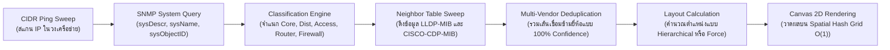

# NetMonitor: ระบบเฝ้าระวังและบริหารจัดการเครือข่ายระดับองค์กร (Enterprise Network Observability & Management Platform)

<p align="center">
  <a href="README.md"><b>English</b></a> | <a href="README.th.md"><b>ภาษาไทย</b></a>
</p>

<p align="center">
  <a href="https://nodejs.org/"></a>
  <a href="https://react.dev/"></a>
  <a href="https://vitejs.dev/"></a>
  <a href="https://www.docker.com/"></a>
  <a href="https://prometheus.io/"></a>
  <a href="https://nginx.org/"></a>
  <a href="https://tailwindcss.com/"></a>
  <a href="https://opensource.org/licenses/MIT"></a>
</p>

---

**NetMonitor** คือแพลตฟอร์มเฝ้าระวัง ตรวจสอบ และบริหารจัดการเครือข่ายระดับองค์กร (Network Observability & Management Platform) แบบ Turn-Key สำหรับเครือข่ายระดับ Campus, Data Center และ Branch Office ระบบได้รวบรวม **การตรวจสอบสถานะอุปกรณ์แบบเรียลไทม์ (Real-Time Monitoring)**, **การวิเคราะห์แนวโน้มข้อมูลย้อนหลัง (Historical Analytics)** และ **การค้นหาและวาดแผนผังเครือข่ายกึ่งอัตโนมัติ (Semi-Automatic L2/L3 Topology Discovery)** เข้าไว้ด้วยกันในแดชบอร์ดเว็บที่ทันสมัย ตอบสนองรวดเร็ว และปลอดภัยตามมาตรฐานสากล

ออกแบบมาเพื่อแก้ไขข้อจำกัดของระบบ Network Management เดิมๆ ด้วยการใช้ **Prometheus Batch PromQL Queries** ที่ดึงข้อมูลสวิตช์ทั้งระบบพร้อมกันในคิวรีเดียว, สถาปัตยกรรม **Server-Sent Events (SSE)** สำหรับส่งข้อมูลอัปเดตแบบ Real-Time สู่หน้าเว็บโดยไม่ต้อง Refresh และ **In-Memory Spatial Topology Engine** บน HTML5 Canvas 2D ที่สามารถเรนเดอร์อุปกรณ์หลายร้อยตัวได้อย่างลื่นไหลที่ 60 FPS

---

## 📚 สารบัญคู่มือทางเทคนิคฉบับสมบูรณ์ (Technical Manuals)

| เอกสารคู่มือ | รายละเอียดเนื้อหา | กลุ่มผู้ใช้งาน |
|---|---|---|
| 🚀 [**คู่มือการติดตั้ง (DEPLOYMENT_GUIDE)**](DEPLOYMENT_GUIDE.th.md) ([EN](DEPLOYMENT_GUIDE.md)) | ขั้นตอนติดตั้งแบบ Turn-key, ตารางคำนวณสเปกฮาร์ดแวร์ (Sizing Matrix), การตั้งค่า SSL/TLS Certificate และแนวทางสำรองข้อมูล | วิศวกรเครือข่ายและระบบ (SysAdmin / NetAdmin) |
| ⚙️ [**คู่มือการกำหนดค่า (CONFIG_REFERENCE.md)**](CONFIG_REFERENCE.md) | ตารางตัวแปรใน `.env`, โครงสร้าง JSON ของอุปกรณ์, รูปแบบ Target YAML ของ Prometheus และ PromQL Catalog | สถาปัตย์ระบบและ DevOps Engineer |
| 🛠️ [**คู่มือการแก้ไขปัญหา (TROUBLESHOOTING)**](TROUBLESHOOTING.th.md) ([EN](TROUBLESHOOTING.md)) | วิธีวิเคราะห์และแก้ไขปัญหาจริง: SNMP Timeout (HTTP 500), 400 Bad Request, ปัญหา Permission Docker, พอร์ตชนกัน | ทีมปฏิบัติการและศูนย์ NOC |
| 👤 [**คู่มือผู้ดูแลระบบ (ADMIN_GUIDE.md)**](ADMIN_GUIDE.md) | การบริหารจัดการผู้ใช้งาน, สิทธิ์ RBAC, การตั้งค่าแจ้งเตือน LINE / Slack / Webhook | ผู้ดูแลระบบไอที (IT Administrator) |
| 💻 [**คู่มือนักพัฒนา (DEVELOPER_GUIDE.md)**](DEVELOPER_GUIDE.md) | โครงสร้างโค้ดภายใน, State Machine, REST API Endpoints และการร่วมพัฒนา | นักพัฒนาซอฟต์แวร์ (Software Engineer) |

---

## สารบัญ (Table of Contents)

1. [ฟีเจอร์เด่นของระบบ (Key Features)](#1-ฟีเจอร์เด่นของระบบ)
2. [สถาปัตยกรรมระบบและความปลอดภัย (Architecture & Security)](#2-สถาปัตยกรรมระบบและความปลอดภัย)
3. [อุปกรณ์และผู้ผลิตที่รองรับ (Supported Hardware & Vendors)](#3-อุปกรณ์และผู้ผลิตที่รองรับ)
4. [การเริ่มต้นติดตั้งอย่างรวดเร็ว (Quick Start Turn-Key Deployment)](#4-การเริ่มต้นติดตั้งอย่างรวดเร็ว)
   - [ติดตั้งบน Linux / macOS / Cloud VM](#ติดตั้งบน-linux--macos--cloud-vm)
   - [ติดตั้งบน Windows / Windows Server](#ติดตั้งบน-windows--windows-server)
   - [โหมดสำหรับนักพัฒนา (Local Development)](#โหมดสำหรับนักพัฒนา)
5. [การตั้งค่าระบบผ่าน Environment Variables](#5-การตั้งค่าระบบผ่าน-environment-variables)
6. [ระบบค้นหาและวาดแผนผังเครือข่าย (Auto-Discovery & Topology)](#6-ระบบค้นหาและวาดแผนผังเครือข่าย)
7. [ระบบแจ้งเตือนอัจฉริยะ (Smart Alerting & Webhooks)](#7-ระบบแจ้งเตือนอัจฉริยะ)
8. [สัญญาอนุญาตและการมีส่วนร่วม (License & Contributing)](#8-สัญญาอนุญาตและการมีส่วนร่วม)

---

## 1. ฟีเจอร์เด่นของระบบ

### 📡 การตรวจสอบแบบเรียลไทม์ (Real-Time Observability)
* **ICMP & SNMP Probing ระดับวินาที:** ขับเคลื่อนโดย Prometheus Blackbox Exporter และ SNMP Exporter
* **แดชบอร์ดแบบไม่ต้อง Refresh:** ส่งข้อมูลสดเข้าหน้าจอผ่าน Server-Sent Events (SSE) ทันทีที่มีการเปลี่ยนแปลง
* **Multi-Window Synchronization:** เปิดหน้าจอพร้อมกันหลายเครื่องหรือหลายแท็บได้โดยไม่เพิ่มภาระให้กับอุปกรณ์เครือข่าย

### 📈 แพลตฟอร์มวิเคราะห์ข้อมูลย้อนหลัง (Historical Analytics)
* **7 โมดูลวิเคราะห์เชิงลึก:**
  1. **Bandwidth & Traffic Throughput:** ปริมาณข้อมูลเข้า-ออก พร้อมรองรับ 64-bit HC Counter ป้องกันปัญหา Counter Overflow บนพอร์ต 10G/40G/100G
  2. **CPU Utilization:** ติดตามการทำงานของ CPU แยก Core และ Control/Data Plane
  3. **Memory Consumption:** อัตราการใช้หน่วยความจำ การรั่วไหลของ Buffer และจุดสูงสุด (Peak)
  4. **Latency & Packet Loss:** สถิติ Round-Trip Time (RTT) และอัตราการสูญเสียแพ็กเก็ต
  5. **Interface Errors & Discards:** ตรวจจับ CRC Errors, Frame Drops และปัญหาทางกายภาพของสายสัญญาณ
  6. **Optical Power & Transceivers:** ตรวจวัดระดับสัญญาณแสง TX/RX และอุณหภูมิของโมดูล SFP/SFP+
  7. **Port Saturation:** ตรวจจับและแจ้งเตือนพอร์ตที่มีการใช้งานเกินเกณฑ์วิกฤต (80%, 90%, 95%)
* **ส่งออกข้อมูล CSV ได้ในคลิกเดียว:** ดาวน์โหลดสถิติย้อนหลังพร้อม Timestamp มาตรฐาน ISO 8601 สำหรับทำรายงาน
* **ระบบแคชอัจฉริยะฝั่งเซิร์ฟเวอร์:** In-Memory Cache อายุ 5 นาที พร้อมระบบเคลียร์ TTL อัตโนมัติ ทำให้เปิดดูกราฟได้อย่างรวดเร็ว

### 🗺️ แผนผังเครือข่ายกึ่งอัตโนมัติ (Semi-Automatic Topology Discovery)
* **รองรับ 2 โปรโตคอลหลัก:** ตรวจจับเพื่อนบ้าน (Neighbors) ผ่าน LLDP และ Cisco CDP พร้อมกัน
* **ระบบรวมลิงก์ข้ามผู้ผลิต (Multi-Vendor Deduplication):** จัดการความสัมพันธ์ของอุปกรณ์ต่างค่ายได้อย่างแม่นยำ เช่น สวิตช์ Cisco รายงานสวิตช์ Aruba ผ่าน CDP ในขณะที่ Aruba รายงาน Cisco ผ่าน LLDP ระบบจะรวมเป็นเส้นเชื่อมเส้นเดียวที่มีความมั่นใจ 100%
* **จำแนกประเภทลิงก์อัตโนมัติ:** แยกประเภท Trunk, Uplink, Access, Discovered และ Manual
* **ระบบจัดวางโครงสร้าง 2 รูปแบบ:** ลำดับชั้นชัดเจน (Hierarchical Layout) และกราฟฟิสิกส์แรงดึง-แรงผลัก (Force-Directed Layout)
* **O(1) Spatial Hash Grid Canvas:** เรนเดอร์บน HTML5 Canvas 2D ที่มีระบบคำนวณตำแหน่งแบบ Grid Indexing รองรับการเลื่อน ซูม เลือกอุปกรณ์กว่า 300 ตัวได้อย่างราบรื่น 60 FPS

---

## 2. สถาปัตยกรรมระบบและความปลอดภัย

```
                          [ Corporate LAN / WAN ]
                                    │
                                    ▼
                     ┌──────────────────────────────┐
                     │     Nginx Gateway (Reverse)  │  Port 80 (HTTP)
                     │     SSL/TLS Termination      │  Port 443 (HTTPS)
                     │  • OWASP Security Headers    │
                     │  • Content Security Policy   │
                     └──────────────┬───────────────┘
                                    │ เครือข่ายภายใน (Internal Network)
           ┌────────────────────────┼────────────────────────┐
           ▼                        ▼                        ▼
  ┌─────────────────┐      ┌─────────────────┐      ┌─────────────────┐
  │ NetMonitor Core │      │ Prometheus TSDB │      │ Grafana Engine  │
  │ Node.js Backend │      │ Metrics Engine  │      │ Embedded Panels │
  │ Non-Root netmon │      │ Port 9090       │      │ Port 3000       │
  │ Port 5001       │      └────────┬────────┘      └─────────────────┘
  └────────┬────────┘               │
           │ Dynamic file_sd        ▼
           └──────────────► ┌────────────────────────────────┐
                            │      Telemetry Exporters       │
                            │  • Blackbox (ICMP Ping) :9115  │
                            │  • SNMP Exporter (UDP 161) :9116│
                            └───────────────┬────────────────┘
                                            │ UDP 161 & ICMP
                                            ▼
                           [ Managed Network Devices ]
                       Switches, Firewalls, Routers, APs
```

### การยกระดับความปลอดภัยระดับองค์กร (Enterprise Hardening)
* **Network Isolation:** พอร์ตของ Prometheus (`9090`), SNMP Exporter (`9116`), Blackbox Exporter (`9115`), Grafana (`3000`) และ Backend (`5001`) ถูกจำกัดให้อยู่ใน Internal Docker Network หรือผูกไว้เฉพาะกับ `127.0.0.1` เท่านั้น ปิดกั้นการเข้าถึงตรงจากภายนอก
* **Non-Root Execution:** เซิร์ฟเวอร์ Node.js รันภายใต้บัญชีระบบที่ไม่มีสิทธิ์ Root (`netmon`, UID 10001)
* **OWASP Security Headers:** บังคับใช้ `X-Frame-Options: SAMEORIGIN`, `X-Content-Type-Options: nosniff`, `Strict-Transport-Security` (HSTS) และ Content Security Policy (CSP) ผ่าน Nginx
* **Role-Based Access Control (RBAC):** แยกสิทธิ์ชัดเจนระหว่าง `Viewer` (ดูอย่างเดียว), `Editor` (จัดการอุปกรณ์) และ `Admin` (จัดการระบบเต็มรูปแบบ)
* **Secret Masking:** ปิดบังรหัสผ่านและ Community String ด้วย `***` เสมอใน API เพื่อความปลอดภัย

---

## 3. อุปกรณ์และผู้ผลิตที่รองรับ

NetMonitor มาพร้อมกับโมดูล SNMP Exporter ที่ปรับแต่งมาเพื่อประสิทธิภาพสูงสุดในไฟล์ `config/snmp_exporter/snmp.yml`:

| ยี่ห้อ / แพลตฟอร์ม | โมดูลที่แนะนำ | ตัวชี้วัดที่จัดเก็บ (Metrics) |
|---|---|---|
| **Cisco Catalyst (IOS / IOS-XE)** | `cisco_switch` | Traffic พอร์ต 64-bit, CDP Neighbors, Cisco CPU (`cpmCPUTotal5minRev`), Memory Pool |
| **Cisco Small Business (C1200/C1300/CBS)** | `cisco_sb` | Traffic พอร์ต 64-bit, LLDP Neighbors, Radlan CPU (`rlCpuUtilDuringLast5Minutes`) |
| **HPE / Aruba (CX, ProCurve, AOS-S)** | `aruba_switch` | Traffic พอร์ต 64-bit, LLDP Neighbors, HP CPU (`hpSwitchCpuStat`), Memory |
| **Huawei (CloudEngine, S5700, VRP)** | `huawei_switch` | Traffic พอร์ต 64-bit, LLDP Neighbors, Huawei CPU (`hwEntityCpuUsage`), Memory |
| **MikroTik (RouterOS, CCR, CRS)** | `mikrotik_router` | Traffic พอร์ต 64-bit, LLDP Neighbors, CPU Load (`hrProcessorLoad`), Storage |
| **Linux / Windows / KVM Servers** | `host_resources` | RFC 2790 CPU (`hrProcessorLoad`), Memory Pool, Storage Volume |
| **APC Smart-UPS / Symmetra** | `apcups` | เปอร์เซ็นต์แบตเตอรี่, Output Load, อุณหภูมิตัวเครื่อง, สถานะแบตเตอรี่ |
| **Synology NAS (DiskStation / RackStation)** | `synology` | สุขภาพระบบ, สถานะ Disk Drive, อุณหภูมิ, พื้นที่ Storage Pool |
| **มาตรฐานสากล (สวิตช์ทุกรุ่น ทุกยี่ห้อ)** | `if_mib` | Universal RFC 2863 64-bit HC In/Out Counters, Admin/Oper Status, LLDP |

---

## 4. การเริ่มต้นติดตั้งอย่างรวดเร็ว (Quick Start Turn-Key Deployment)

### ติดตั้งบน Linux / macOS / Cloud VM
```bash
# 1. Clone repository
git clone https://github.com/Tannyzazanaja/NetMonitor.git
cd NetMonitor

# 2. รันสคริปต์ติดตั้งอัตโนมัติ
chmod +x deploy.sh
./deploy.sh
```
*สคริปต์จะตรวจสอบความพร้อมของระบบ (Docker, RAM, Disk), คัดลอกและสร้างไฟล์ `.env` พร้อมสุ่มรหัสลับทางวิทยาการรหัสลับ (`JWT_SECRET`, `SESSION_SECRET`, `EMERGENCY_PASSWORD`) ให้อัตโนมัติ, จัดการสิทธิ์โฟลเดอร์ และรอเช็กความพร้อมของระบบ (Wait-for-healthy)*

### ติดตั้งบน Windows / Windows Server
```powershell
# เปิด PowerShell ในสิทธิ์ Administrator
Set-ExecutionPolicy -Scope Process -ExecutionPolicy Bypass
.\deploy.ps1
```

### โหมดสำหรับนักพัฒนา
```bash
# ติดตั้ง dependencies ฝั่งหน้าบ้าน
npm install

# ติดตั้ง dependencies ฝั่งหลังบ้าน
cd server && npm install && cd ..

# คัดลอกคอนฟิก
cp .env.example .env

# รัน Vite Dev Server และ Backend พร้อมกัน
npm run dev
```

---

## 5. การตั้งค่าระบบผ่าน Environment Variables

คัดลอกไฟล์ `.env.example` เป็น `.env` เพื่อปรับแต่งค่าที่ต้องการ:

```bash
# พอร์ตสำหรับเข้าใช้งานผ่าน Nginx Gateway
HTTP_PORT=80
HTTPS_PORT=443

# ชื่อองค์กรที่แสดงบนแดชบอร์ด
ORG_NAME="Acme Corp Network Operations Center"

# Subnet CIDR เริ่มต้นสำหรับค้นหาอุปกรณ์
DEFAULT_DISCOVERY_CIDR=192.168.1.0/24

# SNMP Community เริ่มต้น
DEFAULT_SNMP_COMMUNITY=public

# อายุการจัดเก็บข้อมูลใน Prometheus TSDB
PROMETHEUS_RETENTION_TIME=30d
PROMETHEUS_RETENTION_SIZE=50GB
```

*(ศึกษาการตั้งค่าพารามิเตอร์ทั้งหมดอย่างละเอียดได้ที่ [**CONFIG_REFERENCE.md**](CONFIG_REFERENCE.md))*

---

## 6. ระบบค้นหาและวาดแผนผังเครือข่าย

NetMonitor มีระบบ Crawler อัตโนมัติที่แปลงตาราง Neighbor Table ของสวิตช์ให้เป็นแผนผังแบบ Interactive:



---

## 7. ระบบแจ้งเตือนอัจฉริยะ

* **ป้องกันแจ้งเตือนรัว (Flapping Prevention):** มีช่วงหน่วงเวลาประเมินผลเพื่อไม่ให้ส่งแจ้งเตือนซ้ำๆ เมื่อพอร์ตกระพริบ
* **กดรับทราบปัญหาได้ทันที (One-Click Ack):** ผู้ดูแลระบบสามารถกด Acknowledge เพื่อปิดเสียงแจ้งเตือนชั่วคราวขณะกำลังแก้ไขหน้างาน
* **รองรับหลากหลายช่องทาง:** ส่งแจ้งเตือนการ์ดสรุปปัญหาผ่าน LINE Messaging API, Slack, Discord และ Generic HTTP POST Webhook ไปยังระบบ NOC ภายนอก

---

## 8. สัญญาอนุญาตและการมีส่วนร่วม

เผยแพร่ภายใต้สัญญาอนุญาต **MIT License** ดูรายละเอียดเพิ่มเติมได้ที่ไฟล์ `LICENSE`

ยินดีต้อนรับการมีส่วนร่วม การรายงานบั๊ก และการเสนอแนะฟีเจอร์ใหม่ๆ!
สามารถเปิด Pull Request หรือตั้ง Issue ได้ที่ [GitHub Repository](https://github.com/Tannyzazanaja/NetMonitor)

---

<p align="center">
  <i>พัฒนาด้วยความมุ่งมั่นเพื่อระบบเครือข่ายระดับองค์กรที่เสถียร ตรวจสอบได้ และมีประสิทธิภาพสูงสุด</i>
</p>
