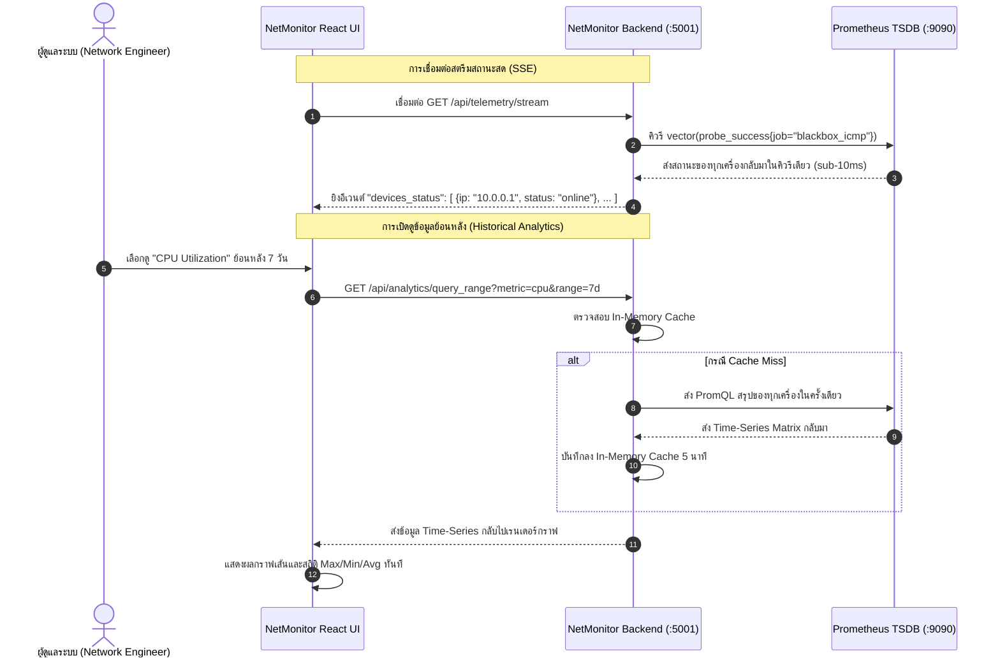
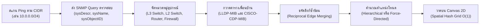

# NetMonitor: ระบบเฝ้าระวังและบริหารจัดการเครือข่ายระดับองค์กร (Enterprise Network Observability & Management Platform)

[English](README.md) | [ภาษาไทย](README.th.md)

[](https://nodejs.org/)
[](https://react.dev/)
[](https://vitejs.dev/)
[](https://prometheus.io/)
[](https://tailwindcss.com/)
[](https://opensource.org/licenses/MIT)

**NetMonitor** คือแพลตฟอร์มเฝ้าระวัง ตรวจสอบ และบริหารจัดการเครือข่ายระดับองค์กร (Network Observability & Management Platform) แบบ Turn-Key สำหรับเครือข่ายระดับ Campus, Data Center และ Branch Office ระบบได้รวบรวม **การตรวจสอบสถานะอุปกรณ์แบบเรียลไทม์ (Real-Time Monitoring)**, **การวิเคราะห์แนวโน้มข้อมูลย้อนหลัง (Historical Analytics)** และ **การค้นหาและวาดแผนผังเครือข่ายกึ่งอัตโนมัติ (Semi-Automatic L2/L3 Topology Discovery)** เข้าไว้ด้วยกันในแดชบอร์ดเว็บที่ทันสมัย ใช้งานง่าย และตอบสนองรวดเร็ว

ออกแบบมาเพื่อแก้ไขข้อจำกัดของระบบ Network Management เดิมๆ ด้วยการใช้ **Prometheus Batch PromQL Queries** ที่ดึงข้อมูลสวิตช์ทั้งระบบพร้อมกันในคิวรีเดียว, สถาปัตยกรรม **Server-Sent Events (SSE)** สำหรับส่งข้อมูลอัปเดตแบบ Real-Time สู่หน้าเว็บโดยไม่ต้อง Polling ให้เซิร์ฟเวอร์ทำงานหนัก และ **In-Memory Spatial Topology Engine** บน HTML5 Canvas 2D ที่สามารถเรนเดอร์อุปกรณ์หลายร้อยตัวได้อย่างลื่นไหลที่ 60 FPS

---

## สารบัญ (Table of Contents)

1. [ภาพรวมโครงการและคุณค่าของระบบ (Project Overview & Value Proposition)](#1-ภาพรวมโครงการและคุณค่าของระบบ)
2. [ฟีเจอร์เด่นของระบบ (Key Features)](#2-ฟีเจอร์เด่นของระบบ)
3. [สถาปัตยกรรมระบบและกระแสข้อมูล (Architecture & Data Flow)](#3-สถาปัตยกรรมระบบและกระแสข้อมูล)
4. [เทคโนโลยีที่ใช้ (Technology Stack)](#4-เทคโนโลยีที่ใช้)
5. [ข้อกำหนดเบื้องต้นและความต้องการของระบบ (Prerequisites & System Requirements)](#5-ข้อกำหนดเบื้องต้นและความต้องการของระบบ)
6. [การเริ่มต้นใช้งานอย่างรวดเร็ว (Quick Start Guide)](#6-การเริ่มต้นใช้งานอย่างรวดเร็ว)
7. [ตัวเลือกการติดตั้งในสภาพแวดล้อมต่างๆ (Installation Options)](#7-ตัวเลือกการติดตั้งในสภาพแวดล้อมต่างๆ)
   - [แบบที่ 1: ติดตั้งบน Bare-Metal / Linux VM (Ubuntu/Debian)](#แบบที่-1-ติดตั้งบน-bare-metal--linux-vm-ubuntudebian)
   - [แบบที่ 2: ติดตั้งผ่าน Docker & Docker Compose](#แบบที่-2-ติดตั้งผ่าน-docker--docker-compose)
   - [แบบที่ 3: ติดตั้งบน Proxmox VE LXC Container](#แบบที่-3-ติดตั้งบน-proxmox-ve-lxc-container)
8. [คู่มือการกำหนดค่าระบบ (Configuration Guide)](#8-คู่มือการกำหนดค่าระบบ)
9. [ระบบค้นหาอุปกรณ์และแผนผังเครือข่าย (Auto-Discovery & Topology)](#9-ระบบค้นหาอุปกรณ์และแผนผังเครือข่าย)
10. [ข้อมูลตัวชี้วัดและการจัดเก็บสถิติ (Metrics & Telemetry)](#10-ข้อมูลตัวชี้วัดและการจัดเก็บสถิติ)
11. [ระบบแจ้งเตือนและเว็บฮุก (Alerts & Webhooks)](#11-ระบบแจ้งเตือนและเว็บฮุก)
12. [ความปลอดภัยและการควบคุมสิทธิ์ (Security & RBAC)](#12-ความปลอดภัยและการควบคุมสิทธิ์)
13. [การแก้ไขปัญหาเบื้องต้นและคำถามที่พบบ่อย (Troubleshooting & FAQ)](#13-การแก้ไขปัญหาเบื้องต้นและคำถามที่พบบ่อย)
14. [สัญญาอนุญาตและการมีส่วนร่วม (License & Contributing)](#14-สัญญาอนุญาตและการมีส่วนร่วม)

---

## 1. ภาพรวมโครงการและคุณค่าของระบบ

ระบบมอนิเตอร์เครือข่ายแบบดั้งเดิมมักพบปัญหาคอขวดที่กระทบต่อเสถียรภาพของระบบ:
* **The N+1 Query Problem:** แดชบอร์ดส่งคิวรีแยกรายอุปกรณ์ (เช่น มี 50 สวิตช์ก็ส่ง 50 PromQL Queries) ส่งผลให้ CPU ของเซิร์ฟเวอร์พุ่งสูง และเบราว์เซอร์ของผู้ดูแลระบบค้าง
* **Scrape Timeouts & Duplication:** มีการสร้างงาน Scrape Ping และ SNMP ซ้ำซ้อน ส่งผลกระทบต่อ Management CPU ของสวิตช์
* **แผนผังเครือข่ายที่ล้าสมัย:** แผนผังเครือข่ายแบบวาดมือไม่ตรงกับความเป็นจริงทันทีที่มีการย้ายพอร์ต เปลี่ยนสาย หรือเกิด Link Failover
* **ความยุ่งยากในการบำรุงรักษา:** ฐานข้อมูล RDBMS ขนาดใหญ่ที่อาจเกิดความเสียหายได้ง่ายเมื่อไฟดับกะทันหัน

**NetMonitor ก้าวข้ามข้อจำกัดเหล่านี้ด้วยหลักการทางสถาปัตยกรรมสมัยใหม่:**
* **Batch Telemetry Aggregation:** ดึงข้อมูล Telemetry ของทุกอุปกรณ์พร้อมกันในคิวรี PromQL เดียวโดยใช้ Vector Regex Matchers ลดเวลาและโหลดลงกว่า 90%
* **Atomic JSON Document Storage:** จัดเก็บข้อมูลอย่างปลอดภัย ทนทานต่อการดับของเครื่อง โดยใช้เทคนิค Atomic Filesystem Write (เขียนไฟล์ `.tmp` แล้ว rename แบบ POSIX) หมดกังวลเรื่องฐานข้อมูลพัง
* **Dynamic Target File Generation:** NetMonitor ทำหน้าที่สร้างไฟล์ `snmp_targets.yml` และ `blackbox_targets.yml` ให้ Prometheus ใช้งานผ่าน `file_sd_configs` อัตโนมัติ ทำให้ไม่ต้องรีสตาร์ต Prometheus เมื่อมีการเพิ่มหรือลดอุปกรณ์
* **Carrier-Grade Discovery:** ผสานข้อมูลจาก SNMP IF-MIB, Bridge-MIB, Cisco CDP และ IEEE 802.1AB LLDP เข้าสู่ Graph Engine พร้อมระบบขจัดลิงก์ซ้ำซ้อน (Deduplication) และคำนวณ Confidence Score อัตโนมัติ

---

## 2. ฟีเจอร์เด่นของระบบ

### 📡 การตรวจสอบแบบเรียลไทม์ (Real-Time Observability)
* **ICMP & SNMP Probing ระดับวินาที:** ขับเคลื่อนโดย Prometheus Blackbox Exporter และ SNMP Exporter
* **แดชบอร์ดแบบไม่ต้อง Refresh:** ส่งข้อมูลสดเข้าหน้าจอผ่าน Server-Sent Events (SSE) ทันทีที่มีการเปลี่ยนแปลง
* **Multi-Window Synchronization:** เปิดหน้าจอพร้อมกันหลายเครื่องหรือหลายแท็บได้โดยไม่เพิ่มภาระให้กับอุปกรณ์เครือข่าย

### 📈 แพลตฟอร์มวิเคราะห์ข้อมูลย้อนหลัง (Historical Analytics)
* **7 โมดูลวิเคราะห์เชิงลึก:**
  1. **Bandwidth & Traffic Throughput:** ปริมาณข้อมูลเข้า-ออก พร้อมรองรับ 64-bit HC Counter ป้องกันปัญหา Counter Overflow บนพอร์ต 10G/40G/100G
  2. **CPU Utilization:** ติดตามการทำงานของ CPU แยก Core และ Control/Data Plane
  3. **Memory Consumption:** อัตราการใช้หน่วยความจำ การรั่วไหลของ Buffer และจุดสูงสุด (Peak)
  4. **Latency & Packet Loss:** สถิติ Round-Trip Time (RTT) และอัตราการสูญเสียแพ็กเก็ต
  5. **Interface Errors & Discards:** ตรวจจับ CRC Errors, Frame Drops และปัญหาทางกายภาพของสายสัญญาณ
  6. **Optical Power & Transceivers:** ตรวจวัดระดับสัญญาณแสง TX/RX และอุณหภูมิของโมดูล SFP/SFP+
  7. **Port Saturation:** ตรวจจับและแจ้งเตือนพอร์ตที่มีการใช้งานเกินเกณฑ์วิกฤต (80%, 90%, 95%)
* **ระบบปรับความละเอียดตามช่วงเวลาแบบไดนามิก (Dynamic Step Resolution):**
  * `1 ชั่วโมง` ➔ ความละเอียด 30 วินาที
  * `6 ชั่วโมง` ➔ ความละเอียด 1 นาที
  * `24 ชั่วโมง` ➔ ความละเอียด 2 นาที
  * `7 วัน` ➔ ความละเอียด 15 นาที
  * `30 วัน` ➔ ความละเอียด 2 ชั่วโมง
* **ส่งออกข้อมูล CSV ได้ในคลิกเดียว:** ดาวน์โหลดสถิติย้อนหลังพร้อม Timestamp มาตรฐาน ISO 8601 สำหรับทำรายงาน
* **ระบบแคชอัจฉริยะฝั่งเซิร์ฟเวอร์:** In-Memory Cache อายุ 5 นาที พร้อมระบบเคลียร์ TTL อัตโนมัติ ทำให้เปิดดูกราฟได้อย่างรวดเร็ว

### 🗺️ แผนผังเครือข่ายกึ่งอัตโนมัติ (Semi-Automatic Topology Discovery)
* **รองรับ 2 โปรโตคอลหลัก:** ตรวจจับเพื่อนบ้าน (Neighbors) ผ่าน LLDP และ Cisco CDP พร้อมกัน
* **ระบบรวมลิงก์ข้ามผู้ผลิต (Multi-Vendor Deduplication):** จัดการความสัมพันธ์ของอุปกรณ์ต่างค่ายได้อย่างแม่นยำ เช่น สวิตช์ Cisco รายงานสวิตช์ Aruba ผ่าน CDP ในขณะที่ Aruba รายงาน Cisco ผ่าน LLDP ระบบจะรวมเป็นเส้นเชื่อมเส้นเดียวที่มีความมั่นใจ 100%
* **จำแนกประเภทลิงก์อัตโนมัติ:** แยกประเภท Trunk, Uplink, Access, Discovered และ Manual
* **ระบบจัดวางโครงสร้าง 2 รูปแบบ:**
  * **Hierarchical Tier Layout:** จัดเรียงเป็นลำดับชั้นชัดเจน (Core ➔ Distribution ➔ Access ➔ Edge)
  * **Force-Directed Physics Layout:** แสดงกราฟแบบฟิสิกส์แรงดึง-แรงผลักตามธรรมชาติ
* **O(1) Spatial Hash Grid Canvas:** เรนเดอร์บน HTML5 Canvas 2D ที่มีระบบคำนวณตำแหน่งแบบ Grid Indexing รองรับการเลื่อน ซูม เลือกอุปกรณ์กว่า 300 ตัวได้อย่างราบรื่น

### 🏭 รองรับอุปกรณ์หลากหลายผู้ผลิต (Multi-Vendor Hardware Telemetry)
* รองรับ OID และ MIB เฉพาะของ:
  * **Cisco Systems:** Catalyst, Nexus, CBS, SG-Series (CISCO-PROCESS-MIB, CISCO-ENVMON-MIB)
  * **Aruba Networks / HPE:** CX-Series, ProCurve, OfficeConnect (STATISTICS-MIB, HP-ICF-CHASSIS)
  * **Ruckus / CommScope:** ICX-Series (FOUNDRY-SN-SWITCH-GROUP-MIB)
  * **Huawei:** CloudEngine, S-Series (HUAWEI-ENTITY-EXTENT-MIB)
  * **Generic RFC Standards:** MIB-II (RFC 1213), IF-MIB (RFC 2863), Entity-MIB (RFC 4133)
* เซ็นเซอร์ฮาร์ดแวร์: อัตราการใช้ CPU, Memory, แหล่งจ่ายไฟ (Power Supply Redundancy), สถานะพัดลม (Fans), อุณหภูมิตัวเครื่อง (Temperature) และการใช้พลังงาน PoE

### 🔔 การแจ้งเตือนอัจฉริยะ (Smart Alerting)
* **ป้องกันการแจ้งเตือนรัว (Flapping Protection):** มีช่วงหน่วงเวลาประเมินผลเพื่อป้องกันการแจ้งเตือนซ้ำซากเมื่อเกิดปัญหาสายสัญญาณกระพริบ
* **ช่องทางแจ้งเตือนที่หลากหลาย:** รองรับ LINE Notify, LINE Messaging API, Telegram Bot, Slack, Discord และ Generic JSON Webhook
* **วงจรชีวิตของการแจ้งเตือน:** ตรวจพบ (Firing) ➔ รับทราบปัญหา (Acknowledged โดยผู้ดูแล) ➔ หายจากปัญหา (Resolved) ➔ บันทึกประวัติ (Archive)

### 🔐 ความปลอดภัยและการควบคุมสิทธิ์ (Security & RBAC)
* **สิทธิ์ 3 ระดับ:** `Admin` (ควบคุมทั้งระบบ), `Editor` (จัดการอุปกรณ์และ Topology), `Viewer` (ดูข้อมูลอย่างเดียว)
* **ระบบล็อกอินฉุกเฉิน (Emergency Break-Glass Authentication):** กลไกล็อกอินสำรองระดับเครื่องเซิร์ฟเวอร์ที่พร้อมทำงานเสมอ แม้ระบบเครือข่ายภายนอกหรือ Identity Provider จะมีปัญหา
* **การปกป้องความลับ:** รหัสผ่านและ SNMP Community Strings จะถูกแปลงเป็น `***` เสมอเมื่อส่งข้อมูลมายังหน้าบ้าน และจะไม่ถูกบันทึกทับโดยไม่ตั้งใจ

---

## 3. สถาปัตยกรรมระบบและกระแสข้อมูล

```mermaid
flowchart TD
    subgraph Network_Infrastructure ["อุปกรณ์เครือข่ายในองค์กร (Managed Network)"]
        SW1["Core Switch (L3)"]
        SW2["Dist Switch (L3)"]
        SW3["Access Switch (L2)"]
        RT1["Edge Router"]
    end

    subgraph Collection_Layer ["ชั้นการเก็บข้อมูล (Telemetry Layer)"]
        BBOX["Prometheus Blackbox Exporter (:9115)<br/>ยิง ICMP Ping วัดสถานะและ Latency"]
        SNMP["Prometheus SNMP Exporter (:9116)<br/>ดึง IF-MIB, Entity-MIB, Vendor MIBs"]
    end

    subgraph TimeSeries_Storage ["ฐานข้อมูลอนุกรมเวลา (Metric Storage)"]
        PROM["Prometheus TSDB (:9090)<br/>Scrape Intervals: 15s / 30s<br/>เก็บข้อมูลย้อนหลัง: 30 - 90 วัน"]
    end

    subgraph NetMonitor_Core ["แกนกลางระบบ NetMonitor"]
        GEN["Target Generator<br/>สร้างไฟล์ targets/*.yml อัตโนมัติ"]
        SERVER["NetMonitor Backend (:5001)<br/>Node.js REST API + SSE Server"]
        DB[("Atomic Document Store<br/>data/db.json ปลอดภัยสูง")]
        CACHE["Analytics Range Cache<br/>In-Memory TTL 5 นาที"]
    end

    subgraph Client_Applications ["ส่วนติดต่อผู้ใช้งาน"]
        UI["NetMonitor React SPA (:5001 / :80)<br/>Vite + Tailwind + Canvas 2D"]
        GRAFANA["Grafana Dashboards (:3000)<br/>แดชบอร์ดวิเคราะห์เพิ่มเติม"]
    end

    SW1 & SW2 & SW3 & RT1 <-->|ICMP Echo| BBOX
    SW1 & SW2 & SW3 & RT1 <-->|SNMP v2c/v3| SNMP
    
    BBOX & SNMP -->|Scraped by HTTP| PROM
    
    SERVER -->|สร้างไฟล์ Scrape Targets| GEN
    GEN -->|file_sd_configs| PROM
    
    SERVER <-->|Vectorized Batch PromQL| PROM
    SERVER <-->|อ่าน/เขียนไฟล์แบบ Atomic| DB
    SERVER <-->|แคชผลลัพธ์การคิวรี| CACHE
    
    SERVER -->|Server-Sent Events (SSE)| UI
    SERVER <-->|REST API (JWT Auth)| UI
    PROM <-->|Embedded Panels| GRAFANA
```

### การคิวรีแบบ Batch PromQL (แก้ปัญหา N+1 Query)



---

## 4. เทคโนโลยีที่ใช้

| ส่วนประกอบ | เทคโนโลยี | เวอร์ชัน | รายละเอียด |
| :--- | :--- | :--- | :--- |
| **Frontend** | React | 18.2.x | ออกแบบ UI แบบโมดูลาร์ ตอบสนองรวดเร็ว |
| | Vite | 5.x | Bundler ยุคใหม่ บิลด์แอสเซทได้ในเสี้ยววินาที |
| | Tailwind CSS | 3.x | จัดการสไตล์แบบ Utility-first รองรับ Dark Mode |
| | Lucide React | ล่าสุด | ไอคอนแบบ Vector คมชัดสูง |
| | HTML5 Canvas | Native | วาดแผนผังเครือข่ายความเร็วสูง 60 FPS |
| **Backend** | Node.js | 18.x / 20.x | สถาปัตยกรรมไร้ Framework หนัก บูตในระดับมิลลิวินาที |
| | Native Modules | `http`, `crypto`, `fs` | ความปลอดภัยสูงสุด ลดการพึ่งพาโมดูลภายนอก |
| **Telemetry** | Prometheus | 2.45+ LTS | ฐานข้อมูล Time-Series ระดับอุตสาหกรรม |
| | SNMP Exporter | 0.24+ | โมดูลดึงค่า SNMP อย่างเป็นทางการของ Prometheus |
| | Blackbox Exporter | 0.24+ | โมดูลยิง ICMP Ping วัดสถานะและ Latency |
| | Grafana | 10.x | ตัวเลือกเสริมสำหรับฝังหน้าจอกราฟเชิงลึก |
| **Storage** | Atomic JSON Document | File-based | จัดเก็บข้อมูลแบบไฟล์ JSON พร้อมระบบความปลอดภัย Atomic Write |

---

## 5. ข้อกำหนดเบื้องต้นและความต้องการของระบบ

### การประเมินขนาดฮาร์ดแวร์ (Hardware Sizing)

| ขนาดของระบบ | จำนวนสวิตช์ที่รองรับ | CPU ขั้นต่ำ | RAM ขั้นต่ำ | พื้นที่จัดเก็บ (Disk) |
| :--- | :--- | :--- | :--- | :--- |
| **สาขาย่อย (Small Branch)** | 1 - 25 เครื่อง | 2 vCPU Cores | 2 GB RAM | 20 GB SSD |
| **องค์กรขนาดกลาง (Medium Enterprise)** | 25 - 150 เครื่อง | 4 vCPU Cores | 4 GB RAM | 50 GB SSD |
| **แคมปัสขนาดใหญ่ (Large Campus)** | 150 - 500 เครื่อง | 8 vCPU Cores | 8 GB RAM | 100 GB NVMe |

### พอร์ตและการเชื่อมต่อเครือข่าย
* สามารถส่ง ICMP Echo Request ไปยังอุปกรณ์ปลายทางได้
* สามารถเชื่อมต่อ UDP พอร์ต `161` (SNMP) ไปยังอุปกรณ์ได้
* เปิด TCP พอร์ต `5001` (NetMonitor Web Application)
* เปิด TCP พอร์ต `9090` (Prometheus API - ใช้งานภายในเครื่องหรือ Network เดียวกัน)

---

## 6. การเริ่มต้นใช้งานอย่างรวดเร็ว

ติดตั้งและเปิดใช้งาน NetMonitor ได้ภายในเวลาไม่เกิน 5 นาที:

### 1. โคลนคลังโค้ด (Clone Repository)
```bash
git clone https://github.com/Tannyzazanaja/NetMonitor.git
cd NetMonitor
```

### 2. ติดตั้ง Dependencies
```bash
# ติดตั้งแพ็กเกจของส่วนหน้าบ้านและระบบหลัก
npm install

# ติดตั้งแพ็กเกจของเซิร์ฟเวอร์
cd server
npm install
cd ..
```

### 3. กำหนดค่าคอนฟิกเริ่มต้น
```bash
cp .env.example .env
```

### 4. คอมไพล์โปรดักชันแอสเซท (Build Frontend)
```bash
npm run build
```

### 5. เริ่มต้นการทำงานของเซิร์ฟเวอร์
```bash
node server/server.js
```

### 6. ใช้งานระบบผ่าน First-Run Setup Wizard
1. เปิดเบราว์เซอร์แล้วเข้าไปที่ `http://localhost:5001`
2. ระบบจะตรวจพบว่าเป็นการติดตั้งใหม่ และเปิดหน้าต่าง **First-Run Setup Wizard** ขึ้นมาโดยอัตโนมัติ
3. ตั้งค่าระบบ 5 ขั้นตอน:
   * **Organization Name:** ใส่ชื่อองค์กรของคุณ
   * **Telemetry Endpoints:** ตรวจสอบ URL ของ Prometheus (`http://localhost:9090`)
   * **Discovery Subnet:** ระบุ Network CIDR ที่ต้องการสแกน (เช่น `192.168.1.0/24` หรือ `10.0.0.0/24`)
   * **Administrator Password:** กำหนดรหัสผ่านสำหรับบัญชีผู้ดูแลระบบ
4. กด **Complete Setup & Launch Dashboard** เพื่อเข้าสู่หน้าจอทำงานหลัก

---

## 7. ตัวเลือกการติดตั้งในสภาพแวดล้อมต่างๆ

### แบบที่ 1: ติดตั้งบน Bare-Metal / Linux VM (Ubuntu/Debian)
สำหรับการติดตั้งระบบบริการ Systemd อย่างละเอียด พร้อมการตั้งค่าสิทธิ์ผู้ใช้งานและสคริปต์อัตโนมัติ สามารถอ่านคู่มือฉบับเต็มได้ที่:
👉 **[อ่านคู่มือการติดตั้งฉบับเต็ม (INSTALLATION.md)](INSTALLATION.md)**

### แบบที่ 2: ติดตั้งผ่าน Docker & Docker Compose
NetMonitor มาพร้อมกับไฟล์ `docker-compose.yml` ที่รันครบ 4 บริการในคำสั่งเดียว:
```bash
# รันทุกบริการขึ้นมาในเบื้องหลัง
docker compose up -d

# ดูบันทึกการทำงาน
docker compose logs -f netmonitor
```

### แบบที่ 3: ติดตั้งบน Proxmox VE LXC Container
แนะนำให้ใช้เทมเพลต `ubuntu-22.04-standard` หรือ `ubuntu-24.04-standard` (2 Cores, RAM 2048 MB, Disk 20 GB) 
*กรณีใช้ Unprivileged Container:* อย่าลืมเปิดใช้งานสิทธิ์ `net_raw` ในไฟล์คอนฟิกคอนเทนเนอร์บน Proxmox เพื่อให้ Blackbox Exporter ยิง Ping ได้โดยไม่ต้องใช้สิทธิ์ Root:
```ini
# เพิ่มใน /etc/pve/lxc/<CTID>.conf
lxc.apparmor.profile: unconfined
lxc.cap.keep: net_raw
```

---

## 8. คู่มือการกำหนดค่าระบบ

### ตัวแปรสภาพแวดล้อม (`.env`)

| ตัวแปร | ค่าเริ่มต้น | ความหมาย |
| :--- | :--- | :--- |
| `PORT` | `5001` | พอร์ต HTTP สำหรับแดชบอร์ดและ API |
| `NODE_ENV` | `production` | โหมดการทำงาน (`production` หรือ `development`) |
| `PROMETHEUS_URL` | `http://127.0.0.1:9090` | URL ปลายทางของ Prometheus Server |
| `PROMETHEUS_TARGETS_DIR` | `/etc/prometheus/targets` | ไดเรกทอรีสำหรับเขียนไฟล์ `snmp_targets.yml` และ `blackbox_targets.yml` |
| `SNMP_EXPORTER_URL` | `http://127.0.0.1:9116` | URL ปลายทางของ Prometheus SNMP Exporter |
| `BLACKBOX_EXPORTER_URL` | `http://127.0.0.1:9115` | URL ปลายทางของ Prometheus Blackbox Exporter |
| `GRAFANA_URL` | `http://127.0.0.1:3000` | URL ปลายทางของ Grafana สำหรับฝังแดชบอร์ด |
| `DEFAULT_DISCOVERY_CIDR` | `192.168.1.0/24` | ซับเน็ตเริ่มต้นสำหรับการสแกนค้นหาอุปกรณ์ |
| `DEFAULT_SNMP_COMMUNITY` | `public` | SNMP v2c Community String เริ่มต้น |
| `DEFAULT_SNMP_AUTH_PROFILE`| `public_v2` | ชื่อโปรไฟล์ Authentication ในไฟล์ `snmp.yml` |

---

## 9. ระบบค้นหาอุปกรณ์และแผนผังเครือข่าย

NetMonitor มีกลไกการค้นหาอุปกรณ์เครือข่ายและการสร้าง Topology อย่างเป็นระบบ:



* **การรวมลิงก์ข้ามผู้ผลิต:** หาก Switch A (พอร์ต Gi1/0/1) เชื่อมต่อไปยัง Switch B (พอร์ต Gi1/0/48) แม้ทั้งสองจะส่งข้อมูลหากันด้วยคนละโปรโตคอล (CDP และ LLDP) ระบบจะจับคู่และรวมเป็นเส้นเชื่อมเดียวที่มีค่าความมั่นใจ 100%
* **ประสิทธิภาพระดับ 60 FPS:** ใช้การแบ่งพื้นที่แบบ Spatial Bucket Partitioning ทำให้การเลื่อน เมาส์โฮเวอร์ และคลิกเลือกอุปกรณ์ทำงานที่ความเร็วคงที่ $O(1)$ แม้จะมีอุปกรณ์กว่า 300 ตัวในหน้าจอเดียว

---

## 10. ข้อมูลตัวชี้วัดและการจัดเก็บสถิติ

| หมวดหมู่ข้อมูล | ตัวชี้วัด / PromQL | คำอธิบาย |
| :--- | :--- | :--- |
| **การเชื่อมต่ออุปกรณ์** | `probe_success{job="blackbox_icmp"}` | 1 = ออนไลน์, 0 = ออฟไลน์ |
| **ความหน่วงเวลา (Latency)**| `probe_duration_seconds{job="blackbox_icmp"} * 1000` | เวลาตอบสนอง Round-trip (มิลลิวินาที) |
| **ปริมาณข้อมูลพอร์ต (Traffic)** | `rate(ifHCInOctets[5m]) * 8`, `rate(ifHCOutOctets[5m]) * 8` | ปริมาณข้อมูลเข้า/ออก (บิตต่อวินาที) |
| **ข้อผิดพลาดบนพอร์ต (Errors)** | `rate(ifInErrors[5m]) + rate(ifOutErrors[5m])` | อัตราข้อผิดพลาดของเฟรมข้อมูล |
| **CPU Cisco** | `ciscoMemoryPoolUsed`, `cpmCPUTotal5minRev` | อัตราการใช้ CPU ของอุปกรณ์ Cisco |
| **CPU Aruba / HP** | `hpSwitchCpuStat`, `arubaMemoryUsage` | อัตราการใช้ CPU ของอุปกรณ์ Aruba/HPE |
| **สถานะฮาร์ดแวร์** | `ciscoEnvMonSupplyState`, `ciscoEnvMonFanState` | สถานะพาวเวอร์ซัพพลายและพัดลมระบายความร้อน |

---

## 11. ระบบแจ้งเตือนและเว็บฮุก

* **ส่งการแจ้งเตือนทันใจ:** ส่งข้อความแจ้งเตือนพร้อมชื่ออุปกรณ์ หมายเลข IP ระดับความรุนแรง ระยะเวลาที่ขัดข้อง และลิงก์ไปยังหน้าจอตรวจสอบ
* **ระบบลดความรำคาญ (Alert Cooldown):** มีช่วงเวลากักกันการแจ้งเตือนซ้ำ (ค่าเริ่มต้น 5 นาที) เพื่อไม่ให้เกิดการส่งข้อความรัวเมื่อเครือข่ายมีอาการ Flapping
* **ปุ่มกดรับทราบปัญหา (Acknowledge):** เจ้าหน้าที่สามารถกดรับทราบปัญหาผ่านหน้าเว็บ เพื่อเปลี่ยนสถานะเป็นสีส้มและระงับการแจ้งเตือนซ้ำระหว่างกำลังแก้ไขปัญหา
* **รองรับ Webhook มาตรฐาน:** สามารถส่งการแจ้งเตือนเข้า LINE, Telegram Bot, Slack, Discord หรือระบบ Ticket ภายในองค์กรผ่าน HTTP POST JSON

---

## 12. ความปลอดภัยและการควบคุมสิทธิ์

1. **การควบคุมสิทธิ์ตามบทบาท (RBAC):**
   * **Viewer:** ดูแดชบอร์ด แผนผังเครือข่าย และกราฟสถิติย้อนหลังได้ ไม่สามารถแก้ไขค่าใดๆ ในระบบได้
   * **Editor:** สามารถเพิ่ม ลบ แก้ไขอุปกรณ์ สั่งสแกนค้นหาเครือข่าย และจัดตำแหน่งแผนผังได้
   * **Admin:** เข้าถึงการตั้งค่าขั้นสูงทั้งหมด จัดการบัญชีผู้ใช้ ตั้งค่า SNMP Community และ Webhook Tokens
2. **ระบบล็อกอินฉุกเฉิน (Emergency Break-Glass Authentication):**
   * หากระบบตรวจสอบสิทธิ์ภายนอกหรือระบบฐานข้อมูลมีปัญหา ผู้ดูแลระบบสามารถใช้ชื่อผู้ใช้ `admin` หรือ `emergency` ร่วมกับรหัสผ่านฉุกเฉินระดับเครื่องเพื่อเข้ากู้คืนระบบได้ทันที
3. **การปกป้องข้อมูลสำคัญ:**
   * ข้อมูลรหัสผ่าน, SNMP Community และ Webhook Tokens จะถูก Mask เป็น `***` เสมอเมื่อส่งมายังหน้าบ้าน เพื่อป้องกันการรั่วไหลผ่าน Browser DevTools

---

## 13. การแก้ไขปัญหาเบื้องต้นและคำถามที่พบบ่อย

### Q1: อุปกรณ์แสดงสถานะ "Offline" บนหน้าเว็บ แต่สามารถ Ping เจอจาก Terminal ได้ปกติ
* **สาเหตุ:** ตัว Blackbox Exporter อาจยังไม่ได้รับสิทธิ์ Raw Socket หรือ NetMonitor ติดต่อไปยัง Prometheus ไม่ได้
* **วิธีแก้ไข:** มอบสิทธิ์ Raw Socket ให้กับ Blackbox Exporter:
  ```bash
  sudo setcap cap_net_raw+ep /usr/local/bin/blackbox_exporter
  ```
  และตรวจสอบว่าตั้งค่า `PROMETHEUS_URL` ในหน้า Settings ตรงกับพอร์ตที่ Prometheus เปิดฟังอยู่จริง

### Q2: ค่าสถิติ SNMP (CPU, RAM, Traffic) แสดงเป็น 0 หรือ "N/A"
* **สาเหตุ:** SNMP Community ไม่ตรง หรือติด Access-List (ACL) บนตัวสวิตช์
* **วิธีแก้ไข:** ทดสอบการดึงข้อมูลจาก Command Line ของเซิร์ฟเวอร์ด้วยคำสั่ง:
  ```bash
  snmpwalk -v2c -c your_community 10.0.0.1 1.3.6.1.2.1.1.1.0
  ```
  ตรวจสอบว่าสวิตช์อนุญาต IP ของเซิร์ฟเวอร์ NetMonitor ใน SNMP Access-List หรือไม่

---

## 14. สัญญาอนุญาตและการมีส่วนร่วม

ระบบนี้เผยแพร่ภายใต้สัญญาอนุญาต **MIT License** สามารถนำไปประยุกต์ใช้งานและพัฒนาต่อได้อย่างอิสระ

หากคุณพบปัญหาหรือต้องการเสนอแนะฟีเจอร์ใหม่ สามารถเปิด Issue หรือส่ง Pull Request ได้ที่ [GitHub Repository](https://github.com/Tannyzazanaja/NetMonitor)

---

*พัฒนาขึ้นด้วยความพิถีพิถันเพื่อความเสถียร ประสิทธิภาพ และความง่ายในการดูแลระบบเครือข่ายระดับองค์กร*
